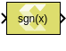

# Signum

Performs signum function (sign extraction) on the input.

## Library

Math Functions/Math Operations



## Description

The Signum block returns the sign for each element of the real input.
The block returns 1, 0, or -1 if the number is positive, equal to 0, or
negative, respectively.

When the input s is complex, the block output is calculated as:

``` pre
sign(s) = s./ abs(s) 
```

Where sign is the MATLAB® signum function, and `./` indicates
element-wise division.

## Data Type Support

The Signum block supports signals of integer type, floating-point type
(double, single and half), and fixed-point type for real inputs. The
complex inputs are supported only for floating point data types.

The output data type, and dimension are the same as those of the input.

## Parameters

The Signum block has no parameters to set.
