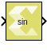

# Sine

Element-wise computation of the sine function for the given input

## Library

Math Functions / Math Operations

## Description

The Sine block returns the output of the function sin(x) for each
element in array x.

## Data Type Support

Data type support is:

- Dimension: Input can be scalar, vector or matrix.
- Data Types: Input supports signals of floating point data types
  (double, single, and half) and signed fixed-point type. It does not
  support integer, Boolean, and unsigned fixed-point data types.
- Complex Numbers: Complex numbers are not supported.

The output has the same dimension and data type as the input. However,
If the data type of the input is a fixed-point type, the data type of
the output is fixed-point type with integer width fixed as 2.

## Parameters

The Sine block has no parameters to set.

--------------
Copyright (C) 2023 Advanced Micro Devices, Inc. All rights reserved.
SPDX-License-Identifier: MIT
