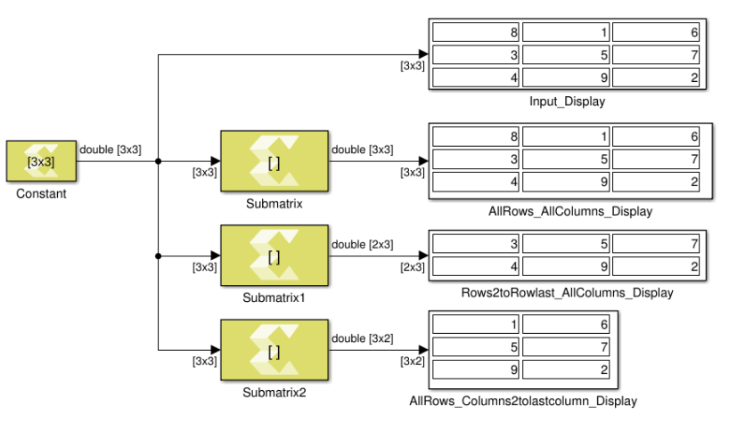

# Submatrix

Select a subset of elements (submatrix) from matrix input

## Library

Math Functions / Matrices and Linear Algebra

## Description

The Submatrix block extracts a contiguous submatrix from the M-by-N
input matrix u. The Row span parameter provides three options for
specifying the range of rows in u to be retained in submatrix output
y:

- All rows: Specifies that y contains all M rows of u.
- One row: Specifies that y contains only one row from u. The Row
  parameter (described below) is enabled to allow selection of the
  desired row.
- Range of rows: Specifies that y contains one or more rows from u.
  The Starting row and Ending row parameters are enabled to allow
  selection of the desired range of rows.

The Column span parameter contains a corresponding set of three options
for specifying the range of columns in u to be retained in the
submatrix y: All columns, One column, or Range of columns. The One
column option enables the Column parameter, and Range of columns options
enable the Starting column and Ending column parameters.

## Data Type Support

All data types are supported. The output type is the same as the input
type.

## Parameters

#### Row span  
The range of input rows to be retained in the output. Options are All
rows, One row, or Range of rows.

#### Row  
The input row to be used as the row of the output. Row is enabled when
you select One row for Row span.

#### Row index  
The index of the input row to be used as the first row of the output.
Row index is enabled when you select Index for Row.

#### Row offset  
The offset of the input row to be used as the first row of the output.
Row offset is enabled when you select Offset from middle or Offset from
last for Row.

#### Starting row  
The input row to be used as the first row of the output. Starting row is
enabled when you select Range of rows for Row span.

#### Starting row index  
The index of the input row to be used as the first row of the output.
Starting row index is enabled when you select Index for Starting row.

#### Starting row offset  
The offset of the input row to be used as the first row of the output.
Starting row offset is enabled when you select Offset from middle or
Offset from last for Starting row.

#### Ending row  
The input row to be used as the last row of the output. Ending row is
enabled when you select Range of rows for Row span and you select any
option but Last for Starting row.

#### Ending row index  
The index of the input row to be used as the last row of the output.
Ending row index is enabled when you select Index for Ending row.

#### Ending row offset  
The offset of the input row to be used as the last row of the output.
Ending row offset is enabled when you select Offset from middle or
Offset from last for Ending row.

#### Column span  
The range of input columns to be retained in the output. Options are All
columns, One column, or Range of columns.

#### Column  
The input column to be used as the column of the output. Column is
enabled when you select One column for Column span.

#### Column index  
The index of the input column to be used as the first column of the
output. Column index is enabled when you select Index for Column.

#### Column offset  
The offset of the input column to be used as the first column of the
output. Column offset is enabled when you select Offset from middle or
Offset from last for Column.

#### Starting column  
The input column to be used as the first column of the output. Starting
column is enabled when you select Range of columns for Column span.

#### Starting column index  
The index of the input column to be used as the first column of the
output. Starting column index is enabled when you select Index for
Starting column.

#### Starting column offset  
The offset of the input column to be used as the first column of the
output. Starting column offset is enabled when you select Offset from
middle or Offset from last for Starting column.

#### Ending column  
The input column to be used as the last column of the output. Ending
column is enabled when you select Range of columns for Column span and
you select any option but Last for Starting column.

#### Ending column index  
The index of the input column to be used as the last column of the
output. Ending column index is enabled when you select Index for Ending
column.

#### Ending column offset  
The offset of the input column to be used as the last column of the
output. Ending column offset is enabled when you select Offset from
middle or Offset from last for Ending column.

--------------
Copyright (C) 2023 Advanced Micro Devices, Inc. All rights reserved.
SPDX-License-Identifier: MIT
