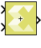

# Sum

Perform element-wise addition of two input signals

## Library

Math Functions / Math Operations

## Description

The Sum block performs element-wise addition of two input signals.

The block warns or errors out when an integer output overflows during
simulation. To configure, select Simulation → Model Configuration
Parameters → Diagnostics → Data Validity for your model in the Simulink
Editor, then set the Wrap on overflow or Saturate on overflow parameter.

## Data Type Support

Data types accepted at the inputs of the block are as follows.

- This block supports all data types supported by Vitis Model Composer.
  The block supports real and complex numbers.
- The input signals can be real or complex numbers of scalar, vector or
  matrix type. When both inputs are non-scalar then their dimensions
  must match.

Output data types are as follows.

- If the data type of one input is a floating point type, the data type
  of the output is the floating point type among the data types of the
  inputs with the most precision.
- Otherwise, if the data type of one input is a fixed-point type, the
  data type of the output is the smallest fixed-point type capable of
  representing the result without any loss of precision.
- Otherwise, if the data type of both inputs is Boolean the output is
  Boolean as well.
- Finally, if one input is integral and the other is also integral or
  Boolean, the output is integral. If both inputs are unsigned the
  output is unsigned, otherwise it is signed. The bit width of the
  output is largest among the bit widths of the inputs.

## Parameters

Saturate on integer overflow

This parameter specifies whether integer overflow is handled by wrapping
(default) or by saturating. This parameter is relevant only if the
output is integral (int8, int16, int32, uint8, uint16, uint32).

Settings for the Saturate on integer overflow parameter are:

| Setting      | Description                                |
|--------------|--------------------------------------------|
| Not selected | Integer overflow is handled by wrapping.   |
| Selected     | Integer overflow is handled by saturation. |

Table 1. Saturate On Integer Overflow Parameter

When overflow is detected, the Diagnostic Viewer displays messages that
depend on the diagnostic action you specify in the Simulink Editor. To
configure, select Simulation → Model Configuration
Parameters → Diagnostics → Data Validity for your model in the Simulink
Editor, then set the Wrap on overflow or Saturate on overflow parameter.
