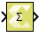

# Sum of Elements

Perform element-wise addition on the input, column-wise, row-wise, or in
all dimensions

## Library

Math Functions / Math Operations

## Description

This block performs element-wise addition on a vector or matrix type
input. If input is a scalar then this block operates as a pass-through.
The output is a scalar type if input is a vector or a matrix and the Sum
over parameter is set as All dimensions.

## Data Type Support

Data type support for the block is:

- The Sum of Elements block supports any floating-point, fixed-point,
  integer or Boolean data type.

- The output type is a scalar or a vector depending on the dimensions of
  the input and the selection of the Sum over parameter.

- The block can perform element-wise addition on real or complex number
  data.

## Parameters

Sum over

The Sum over parameter value is used to decide whether elements will be
added in all dimensions or in one of the dimensions.

Following are settings for the Sum over parameter.

| Setting             | Description                                                                                  |
|---------------------|----------------------------------------------------------------------------------------------|
| All dimensions      | Add all elements of the input signal (output is scalar)                                      |
| Specified dimension | This option shows an edit box, Dimension, where the specific dimension value can be entered. |

Table 1. Sum Over Parameter

Dimension

The Dimension parameter is displayed only if the Sum over parameter
value is set to Specified dimension.

Settings for the Dimension parameter are:

| Setting | Description                                                 |
|:-------:|-------------------------------------------------------------|
|    1    | Add input over row dimension. Output is a row matrix.       |
|    2    | Add input over column dimension. Output is a column matrix. |
