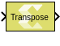

# Transpose

Perform an element-wise transpose operation on the input signal

## Library

Math Functions / Matrices and Linear Algebra

## Description

The Transpose block performs a transpose operation on the input signal.

## Data Type Support

This block supports all data types supported by Vitis Model Composer.
The input signal can be real or a complex number of scalar, vector, or
matrix type. The output type is always the same as that of the input.

## Parameters

The Transpose block has no parameters to set.

--------------
Copyright (C) 2024 Advanced Micro Devices, Inc.
All rights reserved.

SPDX-License-Identifier: MIT
