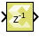

# Unit Delay

Provides a delay of one sample period

## Library

Signal Operations

## Description

The Unit Delay block provides a delay of one sample period. The output
has the same sample time as the input. The output dimension is the same
as the initial condition dimension if the input is scalar. Otherwise,
the output dimension is the same as the input dimension and should match
the dimension of the initial condition.

## Data Type Support

Data type support is:

- All data types are supported.
- Input can be a vector or a matrix. If input is a vector or a matrix
  and the initial value is a scalar, the scalar value will apply to all
  the elements of the input during the first cycle.
- Output is complex if the input is complex.
- If the initial value is complex but the input signal is type real, the
  block gives an error indicating that the input type must be complex.

## Parameters

#### Initial Condition
Specifies the initial value.

The Initial Condition can be scalar, vector, or matrix, of real or
complex type.
