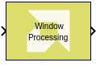
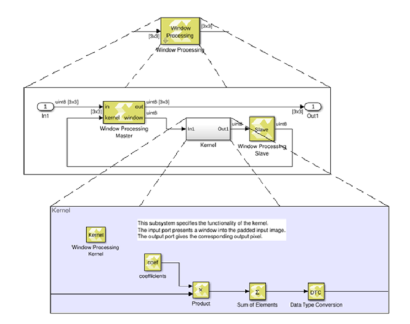

# Window Processing

Assemble an output matrix by applying the kernel subsystem to
submatrices (windows) of the input matrix in row-major order

## Library

Ports and Subsystems

## Description

The Window Processing block is a masked subsystem for assembling an
output matrix by applying a kernel subsystem to sub matrices of the
input matrix in row-major order. You customize the Window Processing
block by specifying its parameters and by adding blocks to the Kernel
subsystem for computing a scalar element of the output in terms of the
corresponding input window. The computation can be thought of to proceed
in the following steps:

1.  Compute the padded input matrix depending on the setting of the
    Output size parameter.

    Let the dimensions of the input be Min,Nin; let the dimensions of
    the window be Mwin, Nwin.

    - If the Output size is set to Valid, no padding is performed, and
      the dimensions of the output are Min-Mwin+1,Nin-Nwin+1.
    - If the Output size is set to Same as input, the input is padded
      with Mwin-1 rows and Nwin-1 columns of 0s. Half of rows added is
      put at the top and the remainder goes at the bottom. If Nwin is
      even then the bottom gets one more row of padding than the top.
      The same is done for adding the columns. The size of the output is
      the same as the size of the input.
    - If the Output size is set to Full, the input is padded with
      2\*(Mwin-1) rows and 2\*(Nwin-1) columns of 0s. Half of the
      padding rows (columns) are added at the top (left) and the other
      half at the bottom (right).

2.  For each element (i,j) of the output (iterate over output in
    row-major order):
    - Select the MxN sub matrix from the padded input matrix starting
      with element (i,j)
    - Apply the kernel subsystem to this sub matrix
    - Assign the scalar output of the kernel to element (i,j) of the
      output.

The hierarchy of the Window Processing block is shown below.

Figure: Hierarchy of Window Processing Block

Restrictions on the use of the Window Processing block are:

- The topology of the window processing subsystem shall not be modified.
  It must match the topology show in the figure above.
- The input signal must be a matrix.
- The kernel must have precisely one input port and one output port.
- The output of the kernel must be scalar.
- The input of the kernel must have the dimensions specified by the
  window size parameter.
- The dimensions of the input must be at least as large as the window
  size.
- The kernel must not contain any of the following blocks:
  - Blocks that have internal state, such as the Unit Delay block.
  - The following Digital Signal Processing blocks: FFT and IFFT.
  - Blocks created with the xmcImportFunction command.
- The kernel must not contain an if-action subsystem.

## Data Type Support

There are no restrictions on the data types of the input or output
signals.

## Parameters

#### Window size

This parameter specifies the size of the window. Enter a 2-element
vector of real positive integers, for example \[5,3\], for the Window
size. 
**Note** The Window size cannot specify more than a total of
255 elements.

#### Output size

This parameter specifies how the edges of the input image are treated.

Let Min, Nin be the dimensions of the input, and let Mwin, Nwin be the
Window size. The dimensions of the output are as follows:

- Min+Mwin-1, Min+Nwin-1 if Full is selected for Output size.
- Min, Nin if Same as Input is selected for Output size.
- Min-Mwin+1, Min-Nwin+1 if Valid is selected for Output size.

--------------
Copyright (C) 2023 Advanced Micro Devices, Inc. All rights reserved.
SPDX-License-Identifier: MIT
