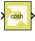

# cosh

Element-wise computation of the hyperbolic cosine for a given argument

## Library

Math Functions / Math Operations

## Description

The cosh block returns the output of the function cosh(x), which is the
hyperbolic cosine, for each element in array x.

The hyperbolic cosine of `x` is:

## Data Type Support

Data type support is:

- Dimension: Input can be scalar, vector, or matrix.
- Data Types: Input supports signals of integer type, floating point
  data types (double, single, and half) and fixed point type.
- Complex Numbers: Complex numbers are not supported.

Output has the same dimension and data type as the input.

## Parameters

The cosh block has no parameters to set.
