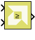
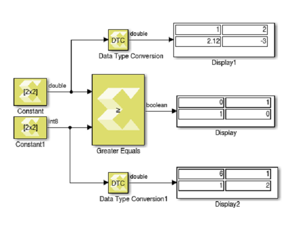

# Greater Equals

Perform element-wise greater than or equal relational operation on the
inputs. The top input corresponds to the first operand.

## Library

Relational Operations

## Description

The Greater Equals block performs element-wise greater than or equal
relational operation on the inputs. The upper input is the first input
and the lower input is the second input. The block returns true if the
first input is greater than or equal to the second input. The output
equals 1 for true and 0 for false.

## Data Type Support

Data types accepted at the inputs of the block are:

- Data Types: Greater Equal block supports all data types supported by
  Model Composer (integer, floating-point, fixed-point, and Boolean).
- Dimension: The inputs can be scalar, vector, or matrix, or a
  combination of scalar, and matrix, or vector. If both the inputs are
  matrix or vector, they should have same dimension.
- Complex Number Support: No

The output is always Boolean.

Outputs for the different input types are:

| Inputs                                          | Output                                    |
|-------------------------------------------------|-------------------------------------------|
| Both are scalar                                 | Scalar                                    |
| Both are vector                                 | Vector of same dimension                  |
| Both are matrix                                 | Matrix of same dimension                  |
| One is scalar and the other is vector or matrix | Dimension is that of the vector or matrix |

## Parameters

The Greater Equals block has no parameters to set.
