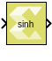

# sinh

Element-wise computation of the hyperbolic sine for a given argument

## Library

Math Functions / Math Operations

## Description

The sinh block returns the output of the function sinh(x), which is the
hyperbolic sine, for each element in array x.

The hyperbolic sine of x is:

## Data Type Support

Data type support is:

- Dimension: Input can be scalar, vector or matrix.
- Data Types: Input supports signals of integer type, floating-point
  data types (double, single, and half) and fixed-point type.
- Complex Numbers: Complex numbers are not supported.

The output has the same dimension and data type as the input.

## Parameters

The sinh block has no parameters to set.

--------------
Copyright (C) 2024 Advanced Micro Devices, Inc.
All rights reserved.

SPDX-License-Identifier: MIT
