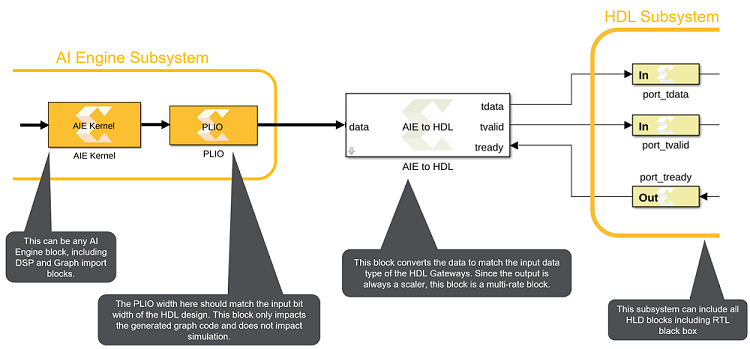

# AIE to HDL

This block is used to connect AI Engine domain to HDL domain using an
AXI4-Stream interface.

  
  

## Library

Utilities/Connectors

## Description

This block provides an interface between the AI Engine and HDL blocks.

- Input to the AIE to HDL block is a variable size signal (data) from
  AIE blocks along with the tready signal which indicates that the
  consumer (HDL) can accept a transfer.
- Output from the AIE to HDL block is tdata and tvalid that indicates
  the producer has valid data available. A transfer takes place when
  both tvalid and tready boolean signals are set to TRUE(1).

If the tready signal is FALSE (0), the block buffers the input data
until the tready signal is TRUE(1). If during simulation, the tready
signal remains FALSE(0) for an extended amount of time, eventually the
internal buffer of the block will overflow and the simulation will stop.

The tdata output is scalar but the data input is a variable size signal,
making this block a multirate block.

If the HDL domain takes N clock cycles to process one input sample,
tready will be TRUE(1) for one cycle out of the N clock cycles. In this
case, the input sample time into the AIE to HDL block must be at least N
times larger than the HDL domain sample period (specified in the HDL
input gateway blocks) to avoid overflow of the internal buffers of the
block.

### Topology

The image below depicts the topology of the connection between the AI
Engine to HDL domain.

Note: The PLIO width should match the bitwidth of the output data type
of the AIE to HDL block and also the output type of the tdata Gateway In
block.

  
  

## Parameters

#### Output Data Type  
The following table shows different Output data types that are supported
by AIE to HDL blocks and the corresponding input data type to the block.

| Output Data Type | Input to AIE to HDL Block                                                                   |
|------------------|---------------------------------------------------------------------------------------------|
| int32            | int32                                                                                       |
| uint32           | int8, uint8, int16, uint16, uint32, single, cint16                                          |
| int64            | int64                                                                                       |
| uint64           | int8, uint8, int16, uint16, cint16, int32, uint32, cint32, uint64, single, single(c)        |
| ufix128          | int8, uint8, int16, uint16, cint16, int32, uint32, cint32, int64, uint64, single, single(c) |

#### Output Sample Time  
By default this parameter inherits the sample time from the tready
input.

**Note**: For more information on setting this block and examples, refer to
[GitHub](https://github.com/Xilinx/Vitis_Model_Composer).
