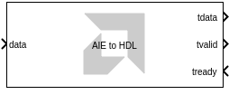

# AIE to HDL

This block is used to connect AI Engine domain to HDL domain using an
AXI4-Stream interface.
  
  

## Library

Utilities/Connectors

## Description

This block translates between AI Engine and HDL data types.

The AXI4-Stream interface is required to interface the AI Engine with an HDL subsystem. AXI4-Stream interfaces have a minimum of 3 signals:

* `tdata`: The data signal.
* `tvalid`: Signal indicating the producer is producing valid data on the tdata signal.
* `tready`: Signal indicating the consumer is ready to receive data on the tdata signal.

For more information, see [How AXI4-Stream Works](https://docs.xilinx.com/r/en-US/ug1399-vitis-hls/How-AXI4-Stream-Works).

**Note:** For more information on setting this block and examples, refer to
the [Connecting AI Engine and HDL Subsystems](https://github.com/Xilinx/Vitis_Model_Composer/blob/HEAD/Tutorials/AIE-PL/AIE_HDL_tutorial) tutorial.

If the tready signal is FALSE (0), the block buffers the input data
until the tready signal is TRUE(1). If during simulation, the tready
signal remains FALSE(0) for an extended amount of time, eventually the
internal buffer of the block will overflow and the simulation will stop.

## Parameters

#### Output Data Type 

Specify the data type of the `data` signal going to the HDL subsystem.

When converting input to output data types, the AIE to HDL block only splits the underlying bits of the data; it does not change their numerical values.

The following table shows the input data types that are needed to produce each output data type.

| Output Data Type | Input Data Type                                                                                       |
|------------------|-------------------------------------------------------------------------------------------------------|
| int32            | int32                                                                                                 |
| uint32           | int8, uint8, int16, uint16, uint32, single, cint16, bfloat16                                          |
| int64            | int64                                                                                                 |
| uint64           | int8, uint8, int16, uint16, cint16, int32, uint32, cint32, uint64, single, single(c), bfloat16        |
| ufix128          | int8, uint8, int16, uint16, cint16, int32, uint32, cint32, int64, uint64, single, single(c), bfloat16 |

#### Output Sample Time  

By default this parameter inherits the sample time from the tready input; in other words, the HDL subsystem will determine its own sample time. You may optionally specify your own sample time for the block.
