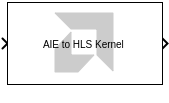
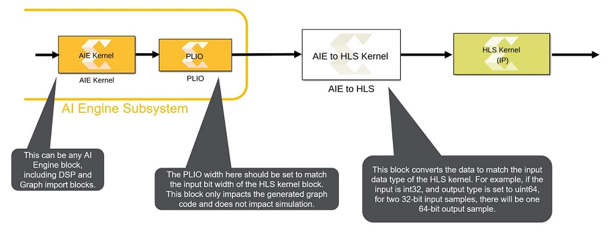

# AIE to HLS

This block is used to connect the AI Engine domain to the HLS kernel
block in cases where the data type or complexity of the ports do not
match.

  
  

## Library

Utilities/Connectors

## Description

The AIE to HLS kernel block reformats a signal driven by an AI Engine
block so that the resulting signal matches the data type and complexity
required by the input of an HLS Kernel block.

## Topology

  
  

## Parameters

Output Data Type  
Possible values are: cint16, int32, uint32, cint32, int64, uint64,
sfix128, ufix128, float, and cfloat

Output Size  
The size of the output port. The output port is a variable sized signal
whose maximum size is specified by the Output Size parameter. Default
Output Size is '1'. For example if the input signal to the block is a
vector of size 24 and of `uint16` data type and the output data type is
set to `uint64`, each output sample will include four input samples. As
such the output size must be equal to or larger than 8.

Note:

1.  The input data type must be one of the following: int8, int16,
    int32, int64, x_sfix128, uint8, uint16, uint32, uint64, x_ufix128.
2.  The input can be real or complex, but complex inputs are supported
    only for int16 and int32.

--------------
Copyright (C) 2023 Advanced Micro Devices, Inc. All rights reserved.
SPDX-License-Identifier: MIT
