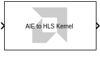
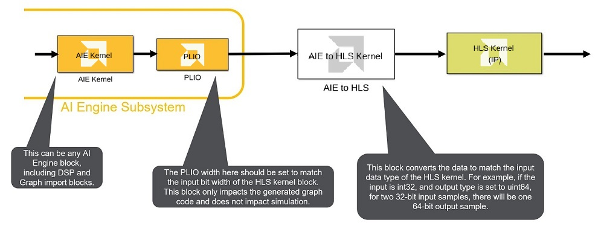

# AIE to HLS

This block is used to connect the AI Engine domain to the HLS kernel
block in cases where the data type or complexity of the ports do not
match.

  
  

## Library

Utilities/Connectors

## Description

The AIE to HLS kernel block reformats a signal driven by an AI Engine
block so that the resulting signal matches the data type and complexity
required by the input of an HLS Kernel block.

For example, if the AI Engine's output data type is `cint16` and the HLS Kernel's input data type
is `ap_axis<64>`, you would use an AIE to HLS kernel block with parameter output type set to
`uint64`. This block reads cint16 samples from its input and then packs pairs of subsequent
`cint16` samples into `uint64` samples to its output.

This block is needed only if the output of the AI Engine block does not match the data type and complexity of the input to the HLS Kernel block. Otherwise, you can directly connect the AI Engine block to the HLS Kernel block.

### Topology
  

## Parameters

#### Output Data Type  
Possible values are: `cint16`, `int32`, `uint32`, `cint32`, `int64`, `uint64`,
`sfix128`, `ufix128`, `float`, `cfloat`

#### Output Size  
The size of the output port. The output port is a variable-sized signal whose
maximum size is specified by the Output Size parameter. The Output Size parameter has a
lower bound, calculated based on the input data type, input size, and output data type. For
example, if the input data type is `cint16`, the input size is 8, and the output data type is
int32, the Output Size parameter must be at least 4. To use a smaller Output Size, enable
the Allow Multiple-Rate Processing parameter.

#### Allow Multiple-Rate Processing 
When this property is enabled, the Output Size parameter
has no lower bound. If the Output Size parameter is set to a value less than the original lower
bound, the output sample rate is greater than the input sample rate.

#### Input Data Type 
This parameter is only visible when Allow Multiple-Rate Processing is enabled.
Possible values are: `int8`, `int16`, `int32`, `int64`, `uint8`, `uint16`, `uint32`, `uint64`,
`cint16`, `cint32`, `float`, `cfloat`, `bfloat16`, `cbfloat16`

### Examples
[Tutorial: Connecting AI Engine and HLS Subsystems](https://github.com/Xilinx/Vitis_Model_Composer/blob/2025.2/Tutorials/AIE-PL/AIE_HLS_tutorial/README.md)

[AIE to HLS Kernel with an interface block](https://github.com/Xilinx/Vitis_Model_Composer/blob/HEAD/Examples/AIENGINE_plus_PL/AIE_HLS/AIE_HLS_with_interface/README.md)

[AIE to HLS Kernel without an interface block](https://github.com/Xilinx/Vitis_Model_Composer/blob/HEAD/Examples/AIENGINE_plus_PL/AIE_HLS/AIE_HLS_without_interface/README.md)

You can find more examples [here](https://github.com/Xilinx/Vitis_Model_Composer/tree/2025.2/Examples/AIENGINE_plus_PL/AIE_HLS).

--------------
Copyright (C) 2025 Advanced Micro Devices, Inc.
All rights reserved.

SPDX-License-Identifier: MIT
