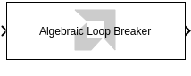
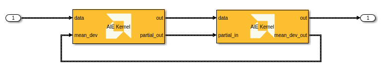
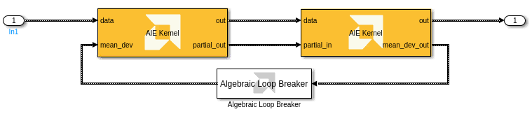

# Algebraic Loop Breaker
This block breaks an algebraic loop inside an AI Engine subsystem.
  
  

## Library

AI Engine/Tools

## Description

This block breaks an algebraic loop that may occur inside an AI Engine subsystem. This block can only be used inside of an AI Engine subsystem. It does not participate in code generation.

Consider the following AI Engine design, where there is a feedback loop between the kernels:

When the model is updated, this design produces a Simulink error: 

`Cannot solve algebraic loop involving 'block' because it consists of blocks that cannot be assigned algebraic variables, such as blocks with discrete-valued outputs, blocks with non-double or complex outputs, Stateflow blocks, or nonvirtual subsystems. Consider breaking the algebraic loop. For example, add a delay or a memory block to the loop. To see more details about the loops use the command Simulink.BlockDiagram.getAlgebraicLoops(bdroot)`

The error message suggests breaking the algebraic loop with a delay or memory block. However, these blocks will not work with variable-sized signals inside an AI Engine subsystem. The Algebraic Loop Breaker block effectively performs a unit delay on the variable-sized signal. The initial output of this block is an empty variable size signal. On subsequent time steps, this block outputs the input signal delayed by one time step.

When the Algebraic Loop Breaker block is inserted into the feedback loop, the model updates and the design simulates as expected.

## Examples

The Normalization example uses an Algebraic Loop Breaker inside the AI Engine subsystem.

## References

For more information on algebraic loops, refer to [Algebraic Loop Concepts](https://www.mathworks.com/help/simulink/ug/algebraic-loops.html) in the Simulink documentation.

--------------
Copyright (C) 2024 Advanced Micro Devices, Inc.
All rights reserved.
