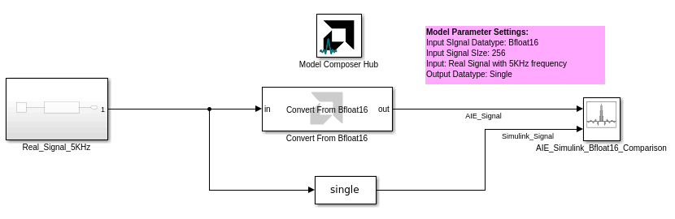
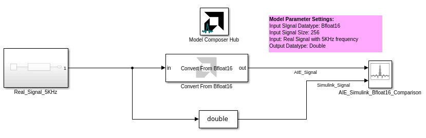

# Convert From Bfloat16
This block converts an AI Engine `bfloat16` value to a Simulink floating point value.
  
  

## Library

AI Engine/Tools

## Description

This block converts an AI Engine `bfloat16` input value to a Simulink floating point output, either `double` or `single`.

On the Simulink canvas, the `bfloat16` signal will have data type `x_bfloat16`. This data type is supported only by AI Engine blocks and should only be used in an AI Engine subsystem. However, the **Convert From Bfloat16** block should be placed outside the AI Engine subsystem.

The output signal will have the same dimensions as the input signal.

## Parameters

#### Output data type

Specify the data type of the output signal. This can be `double` or `single`.

## Examples

***Click on the images below to open each model.***

## Related blocks
[Convert_To_Bfloat16](../Convert_To_Bfloat16/README.md)

## References

`bfloat16` is a 16-bit floating point data type that is supported on AIE-ML devices. For more information on `bfloat16`, refer to [AI Engine-ML Kernel and Graph Programming Guide (UG1603)](https://docs.xilinx.com/r/en-US/ug1603-ai-engine-ml-kernel-graph/Floating-Point-Operations).

