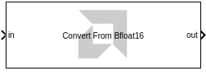
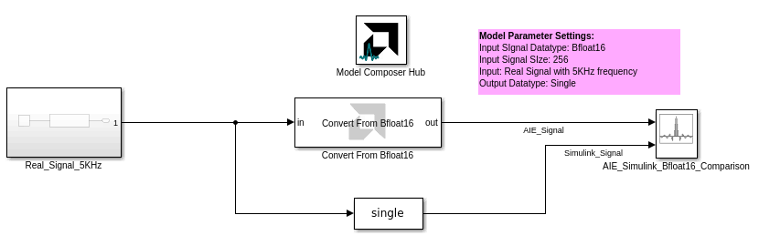
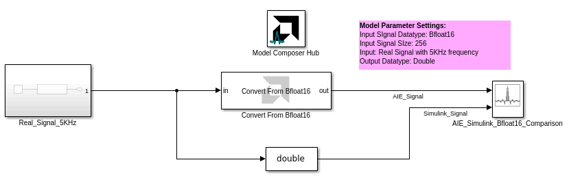

<!-- Library: aieUtilities -->

# Convert From Bfloat16
This block converts an AI Engine `bfloat16` value to a Simulink floating point value.
  
  

## Library

AI Engine/Tools

## Description

This block converts an AI Engine `bfloat16` input value to a Simulink floating point output, either `double` or `single`.

On the Simulink canvas, the `bfloat16` signal will have data type `x_bfloat16`. This data type is supported only by AI Engine blocks and should only be used in an AI Engine subsystem. However, the **Convert From Bfloat16** block should be placed outside the AI Engine subsystem.

The output signal will have the same dimensions as the input signal.

## Parameters

#### Output data type

Specify the data type of the output signal. This can be `double` or `single`.

## Examples

***Click on the images below to open each model.***

<!--
DESCRIPTION:
Model: ConvertFrom_BFloat16_Ex1
Generated: 09-Jan-2026 13:41:24

Vitis Model Composer Configuration:
  Target Device: xcvc2602-nsvh1369-1LHP-i-L

Vitis Model Composer Blocks:
  - AIE: Convert From Bfloat16
  - AIE: Convert To Bfloat16

Description:
This MATLAB script creates a Vitis Model Composer Simulink model that uses the AI Engine Convert From Bfloat16 and Convert To Bfloat16 blocks. A 5kHz real input signal is provided to the block,  and the output is converted and visualized for comparison.

-->

<!--
MATLAB CREATION SCRIPT:

% create_ConvertFrom_BFloat16_Ex1_model.m
% Auto-generated script to recreate the ConvertFrom_BFloat16_Ex1 Simulink model
% Generated on: 09-Jan-2026 13:41:24

%% Model Configuration
modelName = 'ConvertFrom_BFloat16_Ex1_recreated';

%% Create New Model
if bdIsLoaded(modelName)
    close_system(modelName, 0);
end

new_system(modelName);
open_system(modelName);
fprintf('Created new model: %s\n', modelName);

%% Add Vitis Model Composer Hub Block
hubBlockPath = [modelName '/Vitis Model Composer Hub'];
add_block('vmcUtilities/Vitis Model Composer Hub', hubBlockPath, ...
    'Position', [782 58 837 111]);

hubBlk = xmcFindHubBlock(modelName);
vmchub_set_param(hubBlk, modelName, 'SelectHardware', 'xcvc2602-nsvh1369-1LHP-i-L');

%% Add Top-Level Blocks
add_block('built-in/ArrayPlot', [modelName '/AIE_Simulink_Bfloat16_Comparison'], ...
    'Position', [1110 161 1155 214]);
set_param([modelName '/AIE_Simulink_Bfloat16_Comparison'], ...
    'NumInputPorts', '2', ...
    'OpenAtSimulationStart', 'on', ...
    'WindowPosition', '[1.000000,6.000000,1274.000000,655.000000,]', ...
    'XDataMode', 'Sample increment and X-offset', ...
    'SampleIncrement', '1', ...
    'XOffset', '0', ...
    'CustomXData', '[]', ...
    'XScale', 'Linear', ...
    'YScale', 'Linear', ...
    'PlotType', 'Line', ...
    'PlotBaseValue', '0', ...
    'AxesScaling', 'OnceAtStop', ...
    'AxesScalingNumUpdates', '100', ...
    'MaximizeAxes', 'Auto', ...
    'LayoutDimensions', '[1,1]', ...
    'ActiveDisplay', '1', ...
    'PlotAsMagnitudePhase', 'off', ...
    'YLabel', 'Amplitude', ...
    'YLimits', '[-1.25,1.25]', ...
    'ShowGrid', 'on', ...
    'ShowLegend', 'off', ...
    'ChannelNames', '[]');
add_block('aieUtilities/Convert From Bfloat16', [modelName '/Convert From Bfloat16'], ...
    'Position', [715 148 875 202]);
set_param([modelName '/Convert From Bfloat16'], ...
    'OutputDataType', 'single');
add_block('built-in/DataTypeConversion', [modelName '/Data Type Conversion'], ...
    'Position', [780 258 855 292]);
set_param([modelName '/Data Type Conversion'], ...
    'OutMin', '[]', ...
    'OutMax', '[]', ...
    'OutDataTypeStr', 'single', ...
    'LockScale', 'off', ...
    'ConvertRealWorld', 'Real World Value (RWV)', ...
    'RndMeth', 'Floor', ...
    'SaturateOnIntegerOverflow', 'off', ...
    'SampleTime', '-1');
add_block('vmcUtilities/Vitis Model Composer Hub', [modelName '/Model Composer Hub'], ...
    'Position', [782 58 837 111]);
set_param([modelName '/Model Composer Hub'], ...
    'CodeGeneration', 'off', ...
    'CompilationType', 'HDLCompilation', ...
    'ExportTypeV2', 'IP Catalog', ...
    'StartColumn', '1', ...
    'NumberOfColumns', '1', ...
    'TargetDirectory', './netlist', ...
    'exportDesign', 'off', ...
    'analyzeDesign', 'off', ...
    'validateDesignOnHw', 'off', ...
    'ExportType', 'AI Engines', ...
    'IpVendor', 'xilinx.com', ...
    'IpLibrary', 'hls', ...
    'IpVersion', '1.0', ...
    'IpHWLanguage', 'Verilog', ...
    'AieCompilerOptions', '{}', ...
    'CreateTestbench', 'on', ...
    'TestbenchStackSize', '10', ...
    'RunRtlSim', 'off', ...
    'RunCSim', 'off', ...
    'RunAieSim', 'on', ...
    'AieSimTimeout', '50000', ...
    'RunAieSimProfiling', 'off', ...
    'LaunchVitisAnalyzer', 'off', ...
    'PlotOutput', 'off', ...
    'GenHwImage', 'off', ...
    'GenLibadfXo', 'off', ...
    'GenHwValidationCode', 'off', ...
    'PlatformType', 'Not Specified', ...
    'HwSystemType', 'Baremetal', ...
    'HwValidationTarget', 'hw', ...
    'ProjDevice', 'xcvc2602-nsvh1369-1LHP-i-L', ...
    'SamplePeriod', '-1', ...
    'ClockFrequency', '200', ...
    'DataPathParallelism', '1', ...
    'xilinxfamily', 'Kintex7', ...
    'part', 'xc7k325t', ...
    'speed', '-3', ...
    'package', 'fbg676', ...
    'directory', './netlist', ...
    'testbench', 'off', ...
    'incr_netlist', 'off', ...
    'synthesis_tool', 'Vivado', ...
    'clock_wrapper', 'Clock Enables', ...
    'dbl_ovrd', 'According to Block Masks', ...
    'dcm_input_clock_period', '10', ...
    'sysclk_period', '10', ...
    'simulink_period', '1', ...
    'eval_field', '0', ...
    'LogFileName', '/proj/xcoswmktg/robg/git/vmc_examples/gitent/Examples/AIENGINE/DSPlib/Dynamic_FFT/code/model_composer.log', ...
    'NThreads', '4');

%% Create Real_Signal_5KHz Subsystem
add_block('built-in/SubSystem', [modelName '/Real_Signal_5KHz'], ...
    'Position', [400 137 525 213]);

% Remove default blocks
defaultBlocks = find_system([modelName '/Real_Signal_5KHz'], 'SearchDepth', 1, 'Type', 'block');
for i = 1:length(defaultBlocks)
    if ~strcmp(defaultBlocks{i}, [modelName '/Real_Signal_5KHz'])
        delete_block(defaultBlocks{i});
    end
end

add_block('aieUtilities/Convert To Bfloat16', [[modelName '/Real_Signal_5KHz'] '/Convert To Bfloat16'], ...
    'Position', [150 23 310 77]);
add_block('dspsrcs4/Sine Wave', [[modelName '/Real_Signal_5KHz'] '/Sine Wave'], ...
    'Position', [20 28 65 72]);
set_param([[modelName '/Real_Signal_5KHz'] '/Sine Wave'], ...
    'Amplitude', '1', ...
    'Frequency', '5e3', ...
    'Phase', '0', ...
    'SampleMode', 'Discrete', ...
    'OutComplex', 'Real', ...
    'CompMethod', 'Trigonometric fcn', ...
    'TableSize', 'Speed', ...
    'SampleTime', '1/20e3', ...
    'SamplesPerFrame', '256', ...
    'ResetState', 'Restart at time zero', ...
    'OutputFrames', 'off', ...
    'additionalParams', 'off', ...
    'allowOverrides', 'on', ...
    'dataType', 'single', ...
    'wordLen', '16', ...
    'udDataType', 'sfix(16)', ...
    'fracBitsMode', 'User-defined', ...
    'numFracBits', '0', ...
    'OutDataTypeStr', 'single', ...
    'LastOutDataTypeStr', 'single');
add_block('built-in/Outport', [[modelName '/Real_Signal_5KHz'] '/Out1'], ...
    'Position', [365 43 395 57]);
set_param([[modelName '/Real_Signal_5KHz'] '/Out1'], ...
    'Port', '1', ...
    'StorageClass', 'Auto', ...
    'IconDisplay', 'Port number', ...
    'OutputFunctionCall', 'off', ...
    'OutMin', '[]', ...
    'OutMax', '[]', ...
    'OutDataTypeStr', 'Inherit: auto', ...
    'LockScale', 'off', ...
    'BusOutputAsStruct', 'off', ...
    'BusVirtuality', 'inherit', ...
    'DataMode', 'inherit', ...
    'Unit', 'inherit', ...
    'PortDimensions', '-1', ...
    'VarSizeSig', 'Inherit', ...
    'SampleTime', '-1', ...
    'SignalType', 'auto', ...
    'EnsureOutportIsVirtual', 'off', ...
    'OutputWhenDisabled', 'held', ...
    'InitialOutput', '[]', ...
    'MustResolveToSignalObject', 'off', ...
    'OutputWhenUnConnected', 'off', ...
    'OutputWhenUnconnectedValue', '0', ...
    'VectorParamsAs1DForOutWhenUnconnected', 'on');

% Connect blocks in Real_Signal_5KHz
add_line([modelName '/Real_Signal_5KHz'], 'Convert To Bfloat16/2', 'Out1/2', 'autorouting', 'on');
add_line([modelName '/Real_Signal_5KHz'], 'Sine Wave/2', 'Convert To Bfloat16/2', 'autorouting', 'on');

%% Connect Top-Level Blocks
add_line(modelName, 'Real_Signal_5KHz/2', 'Convert From Bfloat16/2', 'autorouting', 'on');
add_line(modelName, 'Real_Signal_5KHz/2', 'Data Type Conversion/2', 'autorouting', 'on');
add_line(modelName, 'Real_Signal_5KHz/2', 'Data Type Conversion/2', 'autorouting', 'on');
add_line(modelName, 'Data Type Conversion/2', 'AIE_Simulink_Bfloat16_Comparison/3', 'autorouting', 'on');
add_line(modelName, 'Convert From Bfloat16/2', 'AIE_Simulink_Bfloat16_Comparison/2', 'autorouting', 'on');

%% Save Model
save_system(modelName);
fprintf('\nModel saved: %s.slx\n', modelName);
-->

<!--
DESCRIPTION:
Model: ConvertFrom_BFloat16_Ex2
Generated: 09-Jan-2026 13:41:25

Vitis Model Composer Configuration:
  Target Device: xcvc2602-nsvh1369-1LHP-i-L

Vitis Model Composer Blocks:
  - AIE: Convert From Bfloat16
  - AIE: Convert To Bfloat16

Description:
This MATLAB script creates a Vitis Model Composer Simulink model that uses the AI Engine Convert From Bfloat16 and Convert To Bfloat16 blocks. A 5kHz real input signal is provided to the block,  and the output is converted and visualized for comparison.

-->

<!--
MATLAB CREATION SCRIPT:

% create_ConvertFrom_BFloat16_Ex2_model.m
% Auto-generated script to recreate the ConvertFrom_BFloat16_Ex2 Simulink model
% Generated on: 09-Jan-2026 13:41:25

%% Model Configuration
modelName = 'ConvertFrom_BFloat16_Ex2_recreated';

%% Create New Model
if bdIsLoaded(modelName)
    close_system(modelName, 0);
end

new_system(modelName);
open_system(modelName);
fprintf('Created new model: %s\n', modelName);

%% Add Vitis Model Composer Hub Block
hubBlockPath = [modelName '/Vitis Model Composer Hub'];
add_block('vmcUtilities/Vitis Model Composer Hub', hubBlockPath, ...
    'Position', [492 53 547 106]);

hubBlk = xmcFindHubBlock(modelName);
vmchub_set_param(hubBlk, modelName, 'SelectHardware', 'xcvc2602-nsvh1369-1LHP-i-L');

%% Add Top-Level Blocks
add_block('built-in/ArrayPlot', [modelName '/AIE_Simulink_Bfloat16_Comparison'], ...
    'Position', [820 156 865 209]);
set_param([modelName '/AIE_Simulink_Bfloat16_Comparison'], ...
    'NumInputPorts', '2', ...
    'OpenAtSimulationStart', 'on', ...
    'WindowPosition', '[1.000000,6.000000,1274.000000,655.000000,]', ...
    'XDataMode', 'Sample increment and X-offset', ...
    'SampleIncrement', '1', ...
    'XOffset', '0', ...
    'CustomXData', '[]', ...
    'XScale', 'Linear', ...
    'YScale', 'Linear', ...
    'PlotType', 'Line', ...
    'PlotBaseValue', '0', ...
    'AxesScaling', 'OnceAtStop', ...
    'AxesScalingNumUpdates', '100', ...
    'MaximizeAxes', 'Auto', ...
    'LayoutDimensions', '[1,1]', ...
    'ActiveDisplay', '1', ...
    'PlotAsMagnitudePhase', 'off', ...
    'YLabel', 'Amplitude', ...
    'YLimits', '[-1.25,1.25]', ...
    'ShowGrid', 'on', ...
    'ShowLegend', 'on', ...
    'ChannelNames', '[]');
add_block('aieUtilities/Convert From Bfloat16', [modelName '/Convert From Bfloat16'], ...
    'Position', [425 143 585 197]);
set_param([modelName '/Convert From Bfloat16'], ...
    'OutputDataType', 'double');
add_block('built-in/DataTypeConversion', [modelName '/Data Type Conversion'], ...
    'Position', [490 253 565 287]);
set_param([modelName '/Data Type Conversion'], ...
    'OutMin', '[]', ...
    'OutMax', '[]', ...
    'OutDataTypeStr', 'double', ...
    'LockScale', 'off', ...
    'ConvertRealWorld', 'Real World Value (RWV)', ...
    'RndMeth', 'Floor', ...
    'SaturateOnIntegerOverflow', 'off', ...
    'SampleTime', '-1');
add_block('vmcUtilities/Vitis Model Composer Hub', [modelName '/Model Composer Hub'], ...
    'Position', [492 53 547 106]);
set_param([modelName '/Model Composer Hub'], ...
    'CodeGeneration', 'off', ...
    'CompilationType', 'HDLCompilation', ...
    'ExportTypeV2', 'IP Catalog', ...
    'StartColumn', '1', ...
    'NumberOfColumns', '1', ...
    'TargetDirectory', './netlist', ...
    'exportDesign', 'off', ...
    'analyzeDesign', 'off', ...
    'validateDesignOnHw', 'off', ...
    'ExportType', 'AI Engines', ...
    'IpVendor', 'xilinx.com', ...
    'IpLibrary', 'hls', ...
    'IpVersion', '1.0', ...
    'IpHWLanguage', 'Verilog', ...
    'AieCompilerOptions', '{}', ...
    'CreateTestbench', 'on', ...
    'TestbenchStackSize', '10', ...
    'RunRtlSim', 'off', ...
    'RunCSim', 'off', ...
    'RunAieSim', 'on', ...
    'AieSimTimeout', '50000', ...
    'RunAieSimProfiling', 'off', ...
    'LaunchVitisAnalyzer', 'off', ...
    'PlotOutput', 'off', ...
    'GenHwImage', 'off', ...
    'GenLibadfXo', 'off', ...
    'GenHwValidationCode', 'off', ...
    'PlatformType', 'Not Specified', ...
    'HwSystemType', 'Baremetal', ...
    'HwValidationTarget', 'hw', ...
    'ProjDevice', 'xcvc2602-nsvh1369-1LHP-i-L', ...
    'SamplePeriod', '-1', ...
    'ClockFrequency', '200', ...
    'DataPathParallelism', '1', ...
    'xilinxfamily', 'Kintex7', ...
    'part', 'xc7k325t', ...
    'speed', '-3', ...
    'package', 'fbg676', ...
    'directory', './netlist', ...
    'testbench', 'off', ...
    'incr_netlist', 'off', ...
    'synthesis_tool', 'Vivado', ...
    'clock_wrapper', 'Clock Enables', ...
    'dbl_ovrd', 'According to Block Masks', ...
    'dcm_input_clock_period', '10', ...
    'sysclk_period', '10', ...
    'simulink_period', '1', ...
    'eval_field', '0', ...
    'LogFileName', '/proj/xcoswmktg/robg/git/vmc_examples/gitent/Examples/AIENGINE/DSPlib/Dynamic_FFT/code/model_composer.log', ...
    'NThreads', '4');

%% Create Real_Signal_5KHz Subsystem
add_block('built-in/SubSystem', [modelName '/Real_Signal_5KHz'], ...
    'Position', [110 132 235 208]);

% Remove default blocks
defaultBlocks = find_system([modelName '/Real_Signal_5KHz'], 'SearchDepth', 1, 'Type', 'block');
for i = 1:length(defaultBlocks)
    if ~strcmp(defaultBlocks{i}, [modelName '/Real_Signal_5KHz'])
        delete_block(defaultBlocks{i});
    end
end

add_block('aieUtilities/Convert To Bfloat16', [[modelName '/Real_Signal_5KHz'] '/Convert To Bfloat16'], ...
    'Position', [150 23 310 77]);
add_block('dspsrcs4/Sine Wave', [[modelName '/Real_Signal_5KHz'] '/Sine Wave'], ...
    'Position', [20 28 65 72]);
set_param([[modelName '/Real_Signal_5KHz'] '/Sine Wave'], ...
    'Amplitude', '1', ...
    'Frequency', '5e3', ...
    'Phase', '0', ...
    'SampleMode', 'Discrete', ...
    'OutComplex', 'Real', ...
    'CompMethod', 'Trigonometric fcn', ...
    'TableSize', 'Speed', ...
    'SampleTime', '1/20e3', ...
    'SamplesPerFrame', '256', ...
    'ResetState', 'Restart at time zero', ...
    'OutputFrames', 'off', ...
    'additionalParams', 'off', ...
    'allowOverrides', 'on', ...
    'dataType', 'single', ...
    'wordLen', '16', ...
    'udDataType', 'sfix(16)', ...
    'fracBitsMode', 'User-defined', ...
    'numFracBits', '0', ...
    'OutDataTypeStr', 'single', ...
    'LastOutDataTypeStr', 'single');
add_block('built-in/Outport', [[modelName '/Real_Signal_5KHz'] '/Out1'], ...
    'Position', [365 43 395 57]);
set_param([[modelName '/Real_Signal_5KHz'] '/Out1'], ...
    'Port', '1', ...
    'StorageClass', 'Auto', ...
    'IconDisplay', 'Port number', ...
    'OutputFunctionCall', 'off', ...
    'OutMin', '[]', ...
    'OutMax', '[]', ...
    'OutDataTypeStr', 'Inherit: auto', ...
    'LockScale', 'off', ...
    'BusOutputAsStruct', 'off', ...
    'BusVirtuality', 'inherit', ...
    'DataMode', 'inherit', ...
    'Unit', 'inherit', ...
    'PortDimensions', '-1', ...
    'VarSizeSig', 'Inherit', ...
    'SampleTime', '-1', ...
    'SignalType', 'auto', ...
    'EnsureOutportIsVirtual', 'off', ...
    'OutputWhenDisabled', 'held', ...
    'InitialOutput', '[]', ...
    'MustResolveToSignalObject', 'off', ...
    'OutputWhenUnConnected', 'off', ...
    'OutputWhenUnconnectedValue', '0', ...
    'VectorParamsAs1DForOutWhenUnconnected', 'on');

% Connect blocks in Real_Signal_5KHz
add_line([modelName '/Real_Signal_5KHz'], 'Convert To Bfloat16/2', 'Out1/2', 'autorouting', 'on');
add_line([modelName '/Real_Signal_5KHz'], 'Sine Wave/2', 'Convert To Bfloat16/2', 'autorouting', 'on');

%% Connect Top-Level Blocks
add_line(modelName, 'Data Type Conversion/2', 'AIE_Simulink_Bfloat16_Comparison/3', 'autorouting', 'on');
add_line(modelName, 'Convert From Bfloat16/2', 'AIE_Simulink_Bfloat16_Comparison/2', 'autorouting', 'on');
add_line(modelName, 'Real_Signal_5KHz/2', 'Convert From Bfloat16/2', 'autorouting', 'on');
add_line(modelName, 'Real_Signal_5KHz/2', 'Data Type Conversion/2', 'autorouting', 'on');
add_line(modelName, 'Real_Signal_5KHz/2', 'Data Type Conversion/2', 'autorouting', 'on');

%% Save Model
save_system(modelName);
fprintf('\nModel saved: %s.slx\n', modelName);
-->

## Related blocks
[Convert_To_Bfloat16](../Convert_To_Bfloat16/README.md)

## References

`bfloat16` is a 16-bit floating point data type that is supported on AIE-ML devices. For more information on `bfloat16`, refer to [AI Engine-ML Kernel and Graph Programming Guide (UG1603)](https://docs.xilinx.com/r/en-US/ug1603-ai-engine-ml-kernel-graph/Floating-Point-Operations).

--------------
Copyright (C) 2025 Advanced Micro Devices, Inc.
All rights reserved.

SPDX-License-Identifier: MIT
