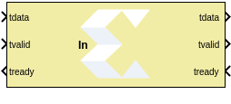
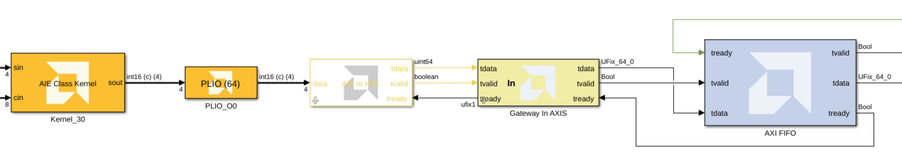
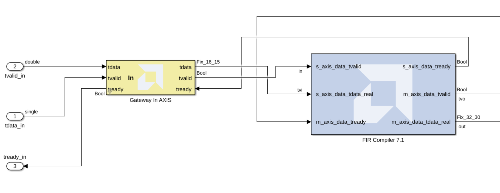

# Gateway In AXI Stream

  
  

## Library

HDL/Interfaces

## Description

This block serves as a utility block to simplify the connection between an HDL block with an input AXI Stream port, which comprises three signal lines: the _tdata_ and _tvalid_ signals going in one direction, and the _tready_ signal going in the opposite direction. Note that in the generated HDL code, the block name will be used as the name for the AXIS port. 

The following figure shows how the block is used when connecting AI Engine blocks to HDL blocks. 
  

This block can also be used to connect Simulink signals to an HDL block with an AXI Stream input as shown below:

## Parameters

Refer to [Gateway In](../../HDL/gatewayin/README.md) block help to learn more about the parameters.

<!--
#### Output Data Type
Set the data type of the block output. Valid types are `cint16`, `cint32`, `cfloat`.
-->

<!--
#### Arithmetic type
In the Arithmetic Type field of the Block Parameters dialog box, you can choose unsigned or signed (two's complement) as the data type of the output signal.
-->

<!--
#### Number of bits
Fixed-point numbers are stored in data types characterized by their word size as specified by Number of bits, Binary point, and Arithmetic type parameters. The maximum number of bits supported is 4096.
-->

<!--
#### Binary point
The binary point is the means by which fixed-point numbers are scaled. The Binary point parameter indicates the number of bits to the right of the binary point (for example, the size of the fraction) for the output port. The binary point position must be between zero and the specified number of bits.
-->

<!--
#### Exponent width
Specify the exponent width.
-->

<!--
#### Fraction width
Specify the fraction width.
-->

<!--
#### Quantization
Quantization errors occur when the number of fractional bits is insufficient to represent the fractional portion of a value. The options are to Truncate (for example, to discard bits to the right of the least significant representable bit), or to Round(unbiased: +/- inf) or Round (unbiased: even values).
-->

<!--
#### Overflow
Overflow errors occur when a value lies outside the representable range. For overflow the options are to Saturate to the largest positive/smallest negative value, to Wrap (for example, to discard bits to the left of the most significant representable bit), or to Flag as error (an overflow as a Simulink error) during simulation. Flag as error is a simulation only feature. The hardware generated is the same as when Wrap is selected.
-->

<!--
#### Sample Period
Data streams are processed at a specific sample rate as they flow through Simulink. Typically, each block detects the input sample rate and produces the correct sample rate on its output. Xilinx blocks Up Sample and Down Sample provide a means to increase or decrease sample rates.
-->

--------------
Copyright (C) 2026 Advanced Micro Devices, Inc.
All rights reserved.

SPDX-License-Identifier: MIT
