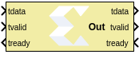
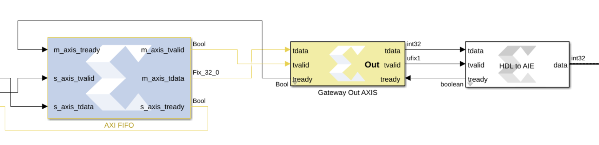

# Gateway Out AXI Stream

  
  

## Library

HDL/Interfaces

## Description

This is a utility block that makes connecting between HDL and AI Engine
domains easier by combining three HDL gateway blocks into one block. It
is primarily used with the HDL to AIE block. Note that the block name
will be used as the AXIS name. The following figure shows an example of
how the block gets connected.

Figure: Gateway out AXI Usage

  
  

## Parameters

Sample Time  
The sample time of the tready signal on the input side. In general, this
parameter should match the sample time of your HDL design.
