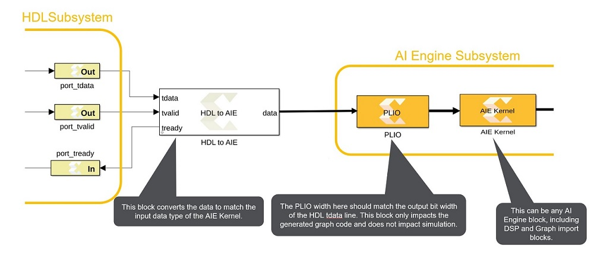

# HDL to AIE

This block is used to connect the HDL domain to the AI Engine domain
using the AXI4-Stream protocol.  
  

## Library

Utilities/Connectors

## Description

This block provides an interface between the HDL and AI Engine blocks.

- Input to the HDL to AIE block is tdata which is the primary input for
  the data. The tvalid signal indicates that the producer has valid
  data.
- Output from the HDL to AIE block is a variable size signal (data) to
  AI Engine blocks along with the tready signal which indicates that the
  HDL to AIE block can accept a transfer. A transfer takes place when
  both tvalid and tready are set to TRUE(1).

### Topology

The following figure depicts the connection between the HDL to AI Engine
domains using the HDL to AIE block.

Note: The bitwidth of the tdata input signal to the HDL to AIE block
must match the PLIO bitwidth.

  

## Parameters

#### Output Data Type  
The following table shows the Output data types that are supported by
the HDL to AIE blocks and the corresponding input data type to the
block.

| Output Data Type | Input to HDL to AIE block |
|------------------|---------------------------|
| int8             | uint32, ufix64, ufix128   |
| uint8            | uint32, ufix64, ufix128   |
| int16            | uint32, ufix64, ufix128   |
| uint16           | uint32, ufix64, ufix128   |
| cint16           | uint32, ufix64, ufix128   |
| int32            | int32, ufix64, ufix128    |
| uint32           | uint32, ufix64, ufix128   |
| cint32           | ufix64, ufix128           |
| int64            | sfix64                    |
| uint64           | ufix64, ufix128           |
| float            | uint32, ufix64, ufix128   |
| float(c)         | ufix64, ufix128           |

#### Output Sample Time  
Set the Output Sample Time to:  
  

Note: For more information on setting this block and examples, refer to
[GitHub](https://github.com/Xilinx/Vitis_Model_Composer).

#### Samples per output frame  
This determines the number of samples to be queued in the buffer before
the block updates the frame. The size of the output frame should
generally match the input size of the consuming AI Engine block.
