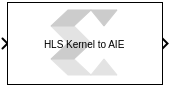
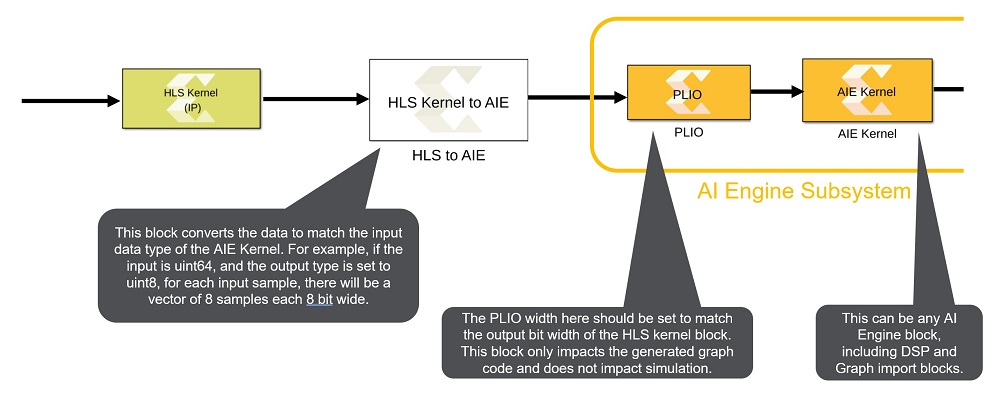

# HLS to AIE

This block is used to connect an HLS kernel block to AI Engine domain
when the datatype or complexities of the ports involved do not match.

  
  

## Library

Utilities/Connectors

## Description

The HLS Kernel to AIE block reformats a signal driven by a port of an
HLS Kernel block so that the resulting signal matches the data type and
complexity required by an AI Engine block.

Note: The inputs to the block must be real and the supported input data
types are: int32, int64, x_sfix128, uint32, uint64, x_ufix128.

### Topology

  
  

## Parameters

#### AIE Input Type  
Possible values are: int8, int16, int32, int64, uint8, uint16, uint32,
uint64, cint16, cint32, float, cfloat, bfloat16

#### Output Size  
The size of the output port. The output port is a variable sized signal
whose maximum size is specified by the Output Size parameter. Default
size is '1'. For example if the input is a vector of size 24, its
datatype is `uint64`, and the output datatype is set to `uint8`, for
each input sample, there will be 8 output samples. As such the Output
Size should be set to 8x24=192 or larger.
