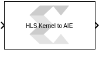
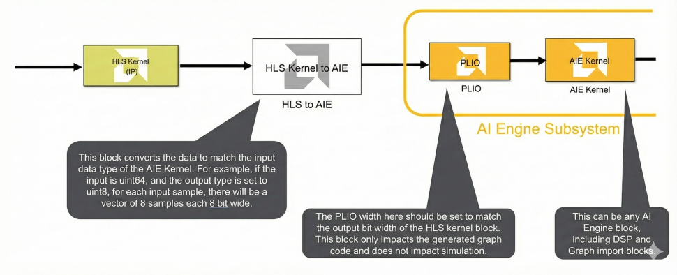

# HLS to AIE

This block is used to connect an HLS kernel block to AI Engine domain
when the datatype or complexities of the ports involved do not match.

  
  

## Library

Utilities/Connectors

## Description

The HLS Kernel to AIE block reformats a signal driven by a port of an
HLS Kernel block so that the resulting signal matches the data type and
complexity required by an AI Engine kernel or graph block.

For example, if the data type of port of the HLS kernel block
is `ap_axis<128>` and the data type of the port of the AI Engine is `uint32`, the HLS Kernel to AIE
block reformats the input samples by unpacking each `ap_axis<128>` sample into four `uint32`
samples. The output port of this block is a variable-size signal.

This block is needed only if the output of the HLS Kernel block does not match the data type and complexity of the input to the AI Engine block. Otherwise, you can directly connect the HLS Kernel block to the AI Engine block.

### Topology  
  

## Parameters

#### Output Data Type
Possible values are: `int8`, `int16`, `int32`, `int64`, `uint8`, `uint16`, `uint32`, `uint64`,
`cint16`, `cint32`, `float`, `cfloat`, `bfloat16`, `cbfloat16`

#### Output Size  
The size of the output port. The output port is a variable-sized signal whose
maximum size is specified by the Output Size parameter. The Output Size parameter has a
lower bound, calculated based on the input data type, input size, and output data type. For
example, if the input data type is `cint16`, the input size is 8, and if the output data type is
`int32`, the Output Size parameter must be at least 4. To use a smaller Output Size, enable the
Allow Multiple-Rate Processing parameter.

If not enough bits are present at the input to fill the output with the specified size and data type, the variable-sized output will have empty samples.

#### Allow Multiple-Rate Processing 
When this property is enabled, the Output Size parameter
has no lower bound. If the Output Size parameter is set to a value less than the original lower
bound, the output sample rate is greater than the input sample rate.

#### Input Data Type
This parameter is only visible when Allow Multiple-Rate Processing is enabled.
Possible values are: `cint16`, `int32`, `uint32`, `cint32`, `int64`, `uint64`, `sfix128`,
`ufix128`, `float`, `cfloat`

### Examples
[Tutorial: Connecting AI Engine and HLS Subsystems](https://github.com/Xilinx/Vitis_Model_Composer/blob/2026.1/Tutorials/AIE-PL/AIE_HLS_tutorial/README.md)

You can find more examples [here](https://github.com/Xilinx/Vitis_Model_Composer/tree/2026.1/Examples/AIENGINE_plus_PL/AIE_HLS).

--------------
Copyright (C) 2026 Advanced Micro Devices, Inc.
All rights reserved.

SPDX-License-Identifier: MIT
