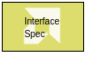
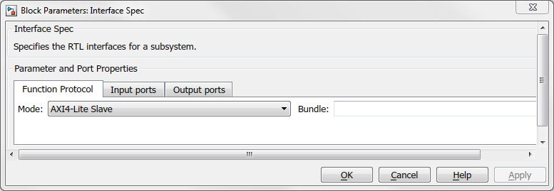
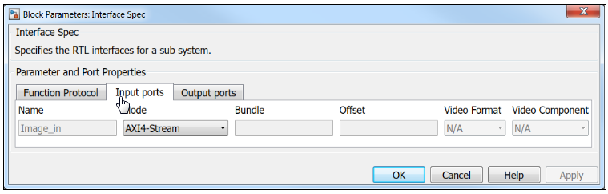
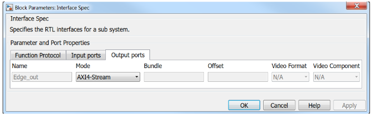

# Interface Spec

Specify the RTL interfaces for a subsystem

## Library

Tools

## Description

The Interface Spec block allows you to control what RTL interfaces
should be synthesized for the ports of the subsystem in which the
Interface Spec block is instantiated. This affects only code generation
and synthesis, when an RTL model (an IP) is synthesized by Vitis HLS
from the C++ model produced by Model Composer. The block has no effect
on Simulink® simulation of your design. If your design does not have an
Interface Spec block, Model Composer selects default interfaces for you.
Interface synthesis is supported only to the subsystem for which you are
generating C++ code. Therefore any Interface Spec blocks instantiated in
subsystems nested within the subsystem for which you are generating C++
code are ignored.

The Interface Spec block is used as follows:

1.  Instantiate the Interface Spec block in the subsystem for which you
    want to generate C++ code. The Input ports tab will be populated
    with one row for each input port of the parent subsystem. Similarly,
    the Output ports tab has one row for each output port of the parent
    subsystem.
2.  Fill out the Function Protocol, Input ports, and Output ports tabs.

The information gathered by the Interface Specification block consists
of three parts:

- The block-level Interface Protocol. This protocol is used to tell the
  IP when to start processing data. It is also used by the IP to
  indicate whether it accepts new data, or whether it has completed an
  operation, or whether it is idle.
- The port-level Interface Protocol for each input port of the parent
  subsystem.
- The port-level interface protocol for each output port of the parent
  subsystem.

The choice of port-level interface protocol should take into account the
following considerations:

- Large array or matrix ports should use a streaming protocol such as
  AXI4-Stream, FIFO, or AXI4-Stream (video).
- Scalar ports can be implemented using any of the following protocols:
  Default, AXI4-Lite Slave, Constant, Valid Port, No protocol
- Video signals can be transported over an AXI4-Stream (video)
  interface. In this case you also need to specify the video format YUV
  4:2:2, YUV 4:4:4, RGB or Mono. For video formats that have more than 1
  color component, you also need to specify which port carries which
  color component and you need to assign the same name for the 'bundle'
  attribute for these (3) ports. All of the ports (either 3 or 1) that
  make up the video signal are implemented by a single AXI4-Stream
  interface that include start-of frame and end-of-line sideband
  signals. This follows the specifications described in the AXI4-Stream
  Video IP and System Design Guide
  ([UG934](https://docs.xilinx.com/access/sources/framemaker/map?isLatest=true&ft:locale=en-US&url=ug934_axi_videoIP)).
- An AXI4-Lite Slave interface allows you to implement one or more
  ports.
- For further details refer to Interface Synthesis in the Vitis
  High-Level Synthesis User Guide
  ([UG1399](https://docs.xilinx.com/access/sources/dita/map?isLatest=true&ft:locale=en-US&url=ug1399-vitis-hls)).

The interface specification block currently supports subsystems with at
most 8 input ports and 8 output ports.

## Data Type Support

Data type support is not applicable to the Interface Spec block.

## Parameters

The parameters for the Interface Specification block fall into the
following groups.

- The parameters that apply to the function protocol. These are Mode,
  and Bundle. In the GUI dialog, these parameters appear in the
  'Functional Protocol' tab.
- The parameters that apply to the Input ports. For each input port,
  there is 1 set of parameters Mode, Bundle, Offset, Video Format, and
  Video Component. In the Block Parameter dialog, these parameters
  appear in the 'Input ports' tab.
- The parameters that apply to the Output ports. For each output port,
  there is 1 set of parameters Mode, Bundle, Offset, Video Format, and
  Video Component. In the GUI dialog, these parameters appear in the
  'Output ports' tab.

Parameters on the Function Protocol tab are as follows:

#### Mode  
The Mode parameter specifies the block-level I/O protocol.

Following are the settings for the Mode parameter.

##### AXI4-Lite Slave
Specifies AXI4-Lite Slave as the block-level I/O protocol.

##### Handshake
Specifies a handshake protocol as the block-level I/O protocol.

##### No block-level I/O Protocol
Specifies that there is no block-level I/O protocol.

The default choice for the function protocol is 'AXI4-Lite Slave'.
However, if the DUT does not have any scalar ports then Handshake is
selected as default function protocol.

#### Bundle  
The Bundle parameter is used in conjunction with the AXI4-Lite Slave
interface to indicate that multiple ports should be grouped into the
same interface. Enter a legal identifier in the C language (cannot
contain spaces or special characters) for Bundle.

Parameters on the Input ports and Output ports tabs are as follows.

#### Mode  
The Mode parameter specifies the I/O protocol for the input port or the
output port.

Settings for the Mode parameter are:

##### Default
Specifies to use AXI4-Lite Slave if port is scalar, and use AXI4-Stream if the port is non-scalar.

##### AXI4-Stream
Specifies AXI4-Stream protocol.

##### AXI4-Stream (video)
Specifies AXI4-Stream (video) protocol. Allows you to specify Bundle, Video Format, and Video Component parameters.

##### AXI4-Lite Slave
Specifies AXI4-Lite Slave protocol. Allows you to specify Bundle and Offset parameters.

##### FIFO
Specifies a protocol for arrays whose elements are accessed in a sequential manner.

##### Valid port
Specifies a handshake protocol that only has a valid port. 

##### Constant
Specifies a mode in which no I/O protocol is added to the port. The mode is intended for configuration inputs which only change when the device is in reset mode.

This mode only applies to Input ports.

##### No protocol
Specifies that no I/O protocol is added to the port.

##### Block RAM
Specifies Block RAM interface protocol.

#### Bundle  
The Bundle parameter applies to the input ports or output ports and it
is used in conjunction with the AXI4-Stream (video) interfaces that have
more than one color component. In this case there should be one port for
each color component and these ports should specify the same name for
the Bundle attribute so that they will be grouped into the same
AXI4-Stream (video) interface.

The parameter is also used in conjunction with AXI4-Lite Slave
interfaces to specify that ports with the same name for the Bundle
attribute will be grouped into the same AXI4-Lite Slave interface.

Enter a legal identifier in the C language (cannot contain spaces or
special characters) for Bundle.

#### Offset  
The Offset parameter applies to the input ports or output ports and it
is used in conjunction with the AXI4-Lite Slave interface. The parameter
allows you to specify the address offset for a port within the AXI4-Lite
Slave address map.

#### Video Format  
The Video Format parameter applies to the input ports or output ports
and it specifies the color format for a video signal. It applies only to
AXI4-Stream (video) interfaces. Options are Mono, YUV 4:2:2, YUV 4:4:4,
and RGB.

#### Video Component  
The VideoComponent parameter applies to the input ports or output ports
and it specifies the color component for a video signal. It applies only
to AXI4-Stream (video) interfaces that use a Video Format with more than
one color component. Options are Mono, YUV 4:2:2, YUV 4:4:4, and RGB.

The Video Component selections for the different Video Format options
are as follows.
| Video Format | Video Component Options |
|--------------|-------------------------|
| Mono         | N/A                     |
| YUV 4:2:2    | Y, U, V                 |
| YUV 4:4:4    | Y, U, V                 |
| RGB          | R, G, B                 |

--------------
Copyright (C) 2024 Advanced Micro Devices, Inc.
All rights reserved.
