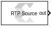

# RTP Source

  
  

## Library

AI Engine/Tools

## Description

This block can be used as a source for the RTP input of an AI Engine
block. When the RTP input is a scalar, the 'RTP Value' parameter should
be a row vector. At each time step, the output is set to one of the
elements of the vector starting with the first element. If an element of
the vector is NaN, at the corresponding sampling time, the output will
be an empty variable size signal.

If the RTP input is a vector, the 'RTP value' parameter should be a
matrix. Each column represents an RTP input vector. A NaN column will
produce an empty variable size signal output.

## Parameters

RTP Value  
This represents the value which can be given as an input to an AI Engine
block. This can be a scalar, vector, or a matrix and it accepts real or
complex data.

Sample Time  
Specifies the interval between the times that the RTP source block
output can change during simulation.

Form output after final data  
Represents a method to determine block output after the final data
point.

Empty  
This option sets the RTP block output to empty after final data.

Holding Final value  
When this option is selected, block holds the final value.

Cyclic repetition  
This option repeats the RTP block data from first value.

--------------
Copyright (C) 2023 Advanced Micro Devices, Inc. All rights reserved.
SPDX-License-Identifier: MIT
