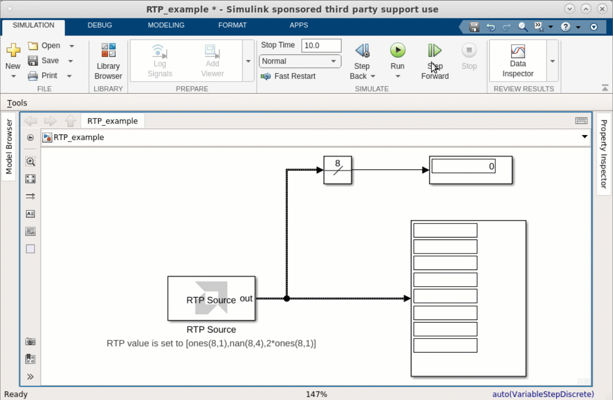

# RTP Source

  
  

## Library

AI Engine/Tools

## Description

This block can be used as a source for the Run Time Parameter (RTP) input of an AI Engine
block. When the RTP input is a scalar, the 'RTP Value' parameter should
be a row vector. At each time step, the output is set to one of the
elements of the vector starting with the first element. If an element of
the vector is NaN, at the corresponding sampling time, the output will
be an empty variable size signal.

If the RTP input is a vector, the 'RTP value' parameter should be a
matrix. Each column represents an RTP input vector. A NaN column will
produce an empty variable size signal output.

This block allows you to verify the behavior of a kernel with an RTP input. A kernel with a synchronous RTP input will require a value at the RTP port at every invocation or else the kernel will not execute. As such during the times when the output of the RTP source block is an empty variable size signal, a kernel with a synchronous RTP input would not execute.

The animation below shows how the block behaves when the value of the RTP is set to _[ones(8,1),nan(8,4),2*ones(8,1)\]_. 
Note the output of the block is a variable size signal. To learn more about variable size signals, click [here](../../GEN/variable-size-signal/README.md). In this animation we are running the simulation one step at a time. In the four periods when the RTP value is a NaN vector, the output of the RTP source block is an empty variable size signal.

The output data type for this block is always double. Follow this block with a Data Type Converter block to convert the data type to a desired data type.

## Parameters

#### RTP Value  
This represents the value which can be given as an input to an AI Engine
block. This can be a scalar, vector, or a matrix and it accepts real or
complex data.

When the 'RTP Value' parameter is a row vector, at each time step, the output is set to one of the
elements of the vector starting with the first element. If an element of
the vector is NaN, at the corresponding sampling time, the output will
be an empty variable size signal.

If the 'RTP value' parameter is a
matrix, each column represents an RTP vector at the output of the block. A NaN column will
produce an empty variable size signal output.

#### Sample Time  
Specifies the interval between the times that the RTP source block
output can change during simulation.

#### Form output after final data  
Represents a method to determine block output after the final data
point.

##### Empty  
This option sets the RTP block output to empty after final data.

##### Holding Final value  
When this option is selected, block holds the final value.

##### Cyclic repetition  
This option repeats the RTP block data from first value.

## Related Examples
[Design with scaler RTP input](https://github.com/Xilinx/Vitis_Model_Composer/blob/HEAD/Examples/AIENGINE/Run_Time_Parameters/rtp_scalar/README.md)

[Design with vector RTP input](https://github.com/Xilinx/Vitis_Model_Composer/blob/HEAD/Examples/AIENGINE/Run_Time_Parameters/rtp_vector/README.md)

## References
To learn more about RTPs click [here](https://docs.xilinx.com/r/en-US/ug1079-ai-engine-kernel-coding/Runtime-Parameter-Specification).

