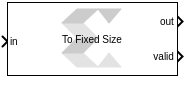

# To Fixed Size

This block takes a variable size vector as an input and produces a fixed
size vector as output. The block copies samples from the input to the
output.

  
  

## Library

AI Engine/Tools

## Description

The To Fixed Size block takes a variable size vector as an input and
produces a fixed size vector as output. The block copies samples from
the input to the output.

The input to the block will be buffered until the number of samples
reaches the Output Size. The buffered samples will then be transferred
to the out port, and the valid signal is set to true. When there are not
enough samples buffered, the output port will be a vector of zeros, and
the valid port is set to false.

Use this block when you need to connect a variable size signal to a
block that does not accept a variable size signal. If the input variable
size signal is not full, the output will not always be valid.

**Note**: It is recommended that you monitor the Valid output to make sure
you are not processing invalid outputs. You can also connect the Valid
output to a triggered subsystem.

## Parameters

#### Output Size  
This specifies the size of the output port:

##### Inherit: Same as Input  
If this option is enabled, the block output size will be the same as
input.

##### Specify Output Size  
When this option is selected, you can specify the value of the required
output size.

**Parent topic:** [Utility Blocks](yjr1649167359223.html)
