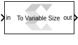

# To Variable Size

  
  

## Library

AI Engine/Tools

## Description

This block takes a fixed sized vector input and produces a variable
sized vector output. The maximum size of the output vector is specified
by the Output Size parameter. If there is not enough samples to pack the
output, the output will be an empty variable size signal.

## Parameters

#### Show Valid Input  
If this option is enabled, the block will only accept the input data
when the valid port is true.

#### Output Size  
This specifies the size of the output port.

##### Inherit : Same as Input  
If this option is enabled, the block will only accept the input data
when the valid port is true.

##### Specify Output Size  
When this option is selected, you can specify the value of the required
output size.

