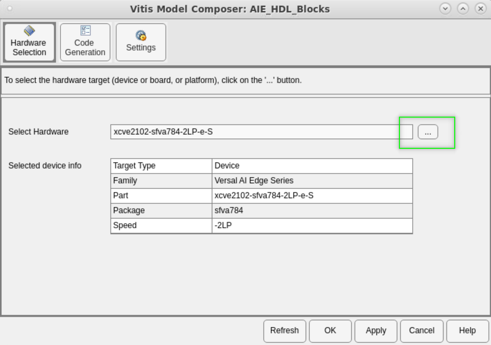

# Vitis Model Composer Hub

Control implementation of the model.

## Library

AI Engine/Tools; HLS/Tools; Utilities/Code Generation.

## Overview

The Vitis Model Composer Hub block controls the behavior of the Vitis Model Composer tool.

You can specify the targeted design flow for the generated output, the directory path for the output, and the desired device and design clock frequency using the following tabs.

- The **Hardware Selection** pane helps with device or board selection.
- The **Code Generation** pane provides tabs to take the design through an elaboration workflow of analysis, validation on hardware, and export out of Vitis Model Composer. Different options will be displayed depending on if the subsystem is targeting HDL, HLS, or AIE.
- The **Design Settings** pane provides miscellaneous settings for the design.

## Data Type Support
Data type support is not applicable to the Vitis Model Composer Hub block.

## Parameters

The following section describes the configurable options available in each pane of the Vitis Model Composer Hub block.

### Hardware Selection
Clicking the browse button (…) displays the Device Chooser dialog box.
This allows you to select a part, board, or platform to which your
design is targeted. Vitis Model Composer obtains board and device data
from the Vivado database.

### Code Generation 
To the left of this tab, a list displays all subsystems in your design. Selecting a subsystem reveals specific settings based on its type (HDL, HLS, or AI Engine). The tool automatically detects the subsystem type based on its internal blocks.

### Settings (HDL)

#### Target Language

Specifies the HDL language to be used for compilation of the design. The possibilities are VHDL and Verilog.
* **VHDL library:** Specifies the name of VHDL work library for code generation. The default name is xil_defaultlib.
* **Use STD_LOGIC type for Boolean or 1 bit wide gateways:** If your design's Hardware Description Language (HDL) is VHDL, selecting this option will declare a Boolean or 1-bit port (Gateway In or Gateway Out) as a STD-LOGIC type. If this option is not selected, Vitis Model Composer will interpret Boolean or 1-bit ports as vectors.

When you enable this option and try to run Generate code and Run behavioral simulation in Vivado, you might see a failure during the elaboration phase.

#### Synthesis Strategy

Choose a Synthesis strategy from the pre-defined strategies in the drop-down menu.

#### Implementation Strategy

Choose an Implementation strategy from the pre-defined strategies in the drop-down menu.

#### Enable multiple clocks

Must be enabled when the design has multiple clocks. This indicates to the code generation engine that the clock information for the various subsystems must be obtained from the respective clock tabs. If not enabled, then the design will be treated as a single clock design.

#### Number of clocks

Defines the number of clocks in the design. The number of clock tabs that appear will be equivalent to the number of clocks. In each clock tab, you must select the subsystem and configure the clock settings of that subsystem.

#### FPGA clock period (ns)

Defines the period in nanoseconds of the system clock. The value need not be an integer. The period is passed to the AMD implementation tools through a constraints file, where it is used as the global PERIOD constraint. Multicycle paths are constrained to integer multiples of this value.

#### Simulink system period (sec)

Defines the Simulink System Period, in units of seconds. The Simulink system period is the greatest common divisor of the sample periods that appear in the model. These sample periods are set explicitly in the block dialog boxes, inherited according to Simulink's propagation rules, or implied by a hardware oversampling rate in blocks with this option. In the final case, the implied sample time is in fact faster than the observable simulation sample time for the block in Simulink. In hardware, a block having an oversampling rate greater than one processes its inputs at a faster rate than the data. For example, a sequential multiplier block with an over-sampling rate of eight implies a (Simulink) sample period that is one eighth of the multiplier block’s actual sample time in Simulink. This parameter can be modified only in a master block.

#### Clock pin location

Defines the pin location for the hardware clock. This information is passed to the AMD implementation tools through a constraints file. This option should not be specified if the Vitis Model Composer design is to be included as part of a larger HDL design.

#### Provide clock enable clear pin

This instructs Vitis Model Composer to provide a ce_clr port on the top-level clock wrapper. The ce_clr signal is used to reset the clock enable generation logic. The ability to reset clock enable generation logic allows designs to have dynamic control for specifying the beginning of data path sampling. This signal is important for modules that will be implemented in a DFX platform.

### Settings (AIE)

#### AIE Compiler Options

Provides the ability to pass additional command line options (debug options, execution target options etc.) to the AIE Compiler.

### Settings (HLS)

#### FPGA clock frequency

Specifies the clock frequency in MHz for the targeted device. This frequency is passed to the downstream tool flow.

#### Testbench stack size (MBytes)

This parameter prompts you to enter a larger stack size. When Create and run testbench is enabled, the Testbench stack size option specifies the size of the testbench stack frame during C simulation (CSIM). Occasionally, the default stack frame size of 10 MB allocate for execution of the testbench may be insufficient to run the test, due to large arrays allocated on the stack and/or deep nesting of subsystems. Typically when this happens, the test would fail with a segmentation fault and an associated error message. In such a case you can increase the size of the stack frame and rerun the test.

### Analyze (HDL)

For more information about the tasks available on this tab, refer to <a href="https://docs.amd.com/r/en-US/ug1483-model-composer-sys-gen-user-guide/Performing-Analysis-in-Vitis-Model-Composer">Performing Analysis in Vitis Model Composer</a> in the Vitis Model Composer User Guide.

#### Target Directory

Specifies the work directory for performing the actions on this tab.

#### Perform Analysis

Specifies whether an analysis (timing or resource) will or will not be performed on the Vitis Model Composer design when it is compiled. If None is selected, no timing analysis or resource analysis will be performed. If Post Synthesis is selected, the analysis will be performed after the design has been synthesized in the Vivado toolset. If Post Implementation is selected, the analysis will be performed after the design is implemented in the Vivado toolset.

#### Analysis Type

Two selections are provided: Timing or Resource. After generation is completed, a Timing Analyzer table or Resource Analyzer table is launched.

#### Block Icon Display

Specifies the type of information to be displayed on each block icon in the model after compilation is complete. The various display options are described below.
* **Default:** Displays the default block icon information on each block in the model. A block’s default icon is derived from the xbsIndex library.

* **Normalized Sample Periods:** Displays the normalized sample periods for all the input and output ports on each block. For example, if the Simulink System Period is set to 4 and the sample period propagated to a block port is 4, then the normalized period that is displayed for the block port is 1; and if the period propagated to the block port is 8 then the sample period displayed would be 2 (a larger number indicates a slower rate).

* **Sample frequencies (MHz):** Displays sample frequencies for each block.
* **Pipeline stages:** Displays the latency information from the input ports of each block. The displayed pipeline stage might not be accurate for certain high-level blocks such as the FFT, RS Encoder/Decoder, Viterbi Decoder, etc. In this case the displayed pipeline information can be used to determine whether a block has a combinational path from the input to the output. For example, the Up Sample block in the following figure shows that it has a combinational path from the input to the output port.

* **HDL port names:** Displays the HDL port name of each port on each block in the model.
* **Input data types:** Displays the data type of each input port on each block in the model.
* **Output data types:** Displays the data type of each output port on each block in the model.

#### Update the model

Update the model to display the selected Block Icon type.

#### Create interface document

When this check box is selected and the Generate button is activated for netlisting, Vitis Model Composer creates an HTM document that describes the design being netlisted. This document is placed in a documentation subfolder under the netlist folder.

### Analyze (AIE)

#### Target Directory

Specifies the work directory for performing the actions on this tab.

#### AIE Simulator Options

Provides the ability to pass additional command line options to the AIE Simulator.

#### Simulation timeout (cycles)

Specifies the number of cycles for which AIE simulation is run. The default value is 50000.

There is no relation between the Simulink stop time/sample time and the AIE simulation timeout in cycles. If the AIE simulation appears to produce no output, it may be necessary to increase the simulation timeout parameter.

#### Collect profiling statistics and enable 'printf' for debugging

When enabled, this option allows profiling data to be collected for analysis.

#### Collect trace data for Vitis Analyzer, viewing internal signals, and latency

When enabled, this option collects trace data for signals within the AI Engine design to be viewed in Vitis Analyzer or the Simulation Data Inspector.

#### View AIE Simulation output and throughput

Opens the Simulation Data Inspector to plot the outputs of the AI Engine subsystem as simulated by the AIE Simulator.

#### Open Vitis Analyzer

Click to invoke the Vitis Analyzer tool. This option is only enabled after AI Engine Simulation has been ran at least once after enabling.

### Analyze (HLS)

#### Target Directory

Specifies the work directory for performing the actions on this tab.

### Validate on Hardware

#### Target Directory

Specifies the work directory for performing the actions on this tab.

#### HW System Type

Choose between Baremetal or Linux hardware validation flow.

#### Target

Specify the target for hardware validation flow.

#### Common SW Dir

Provide the path to the folder containing the PetaLinux common images. This option is only enabled when a Linux HW System Type is selected.

#### Target SDK Dir

Provide the path to the folder containing the target SDK. This option is only enabled when a Linux HW System Type is selected.

#### Generate (BOOT.BIN/SD card image) after code generation

When enabled, a BOOT.BIN (for baremetal HW system) or SD card image (for Linux HW system) will be generated after code generation.

### Export

#### Export Directory

Specifies the directory where the export products will be created.

#### Export Type

* **IP Catalog:** Export HDL or HLS subsystem as a Vivado IP. When IP Catalog is selected, the Settings (...) button brings up a dialog box that allows you to add a description of the IP that will be placed in the IP catalog.
* **Synthesized Checkpoint:** Export HDL subsystem as a Synthesized Checkpoint for use in Vivado.
* **HDL Netlist:** Export HDL subsystem as HDL code and netlist for use in Vivado.
* **Vitis HLS:** Export HLS subsystem as HLS C/C++ code.
* **Vitis Hardware Kernel (.xo):** Export AIE or HLS subsystem as a compiled Vitis Hardware Kernel (.xo).
* **Graph Code:** Export AIE subsystem as AI Engine graph code.
* **Compiled AI Engine Graph Application (libadf.a):** Export AIE subsystem as a compiled AI Engine graph.

#### Generate testbench

* **HDL designs:** This instructs Vitis Model Composer to create an HDL test bench. Simulating the test bench in an HDL simulator compares Simulink simulation results with ones obtained from the compiled version of the design. To construct test vectors, Vitis Model Composer simulates the design in Simulink, and saves the values seen at gateways. The top HDL file for the test bench is named <name>_testbench.vhd/.v, where <name> is a name derived from the portion of the design being tested.

Testbench generation is not supported for designs that have gateways (Gateway In or Gateway Out) configured as an AXI4-Lite interface.

* **AIE/HLS designs:** When enabled, Vitis Model Composer generates the test vectors while generating the code.

### Design Settings

#### Treat this model as a legacy System Generator design for backward-compatibility

Specify whether the Model Composer Hub block should treat your model as a legacy System Generator design. When you automatically upgrade a System Generator token to the Model Composer Hub block, this check box is automatically enabled. When the check box is enabled, you can use the Model Composer Hub block without requiring changes to your legacy designs. However, newer capabilities provided by the Model Composer Hub block, such as the Validate on Hardware Flow, will not be available.

#### Number of parallel AI Engine builds

To speed up model compilation, Vitis Model Composer can build the AI Engine blocks in parallel, taking advantage of multiple cores on your machine. This value can be increased up to maximum number of cores on your machine.

--------------
Copyright (C) 2024 Advanced Micro Devices, Inc.
All rights reserved.

SPDX-License-Identifier: MIT
