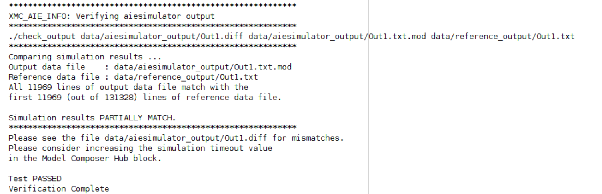

# Vitis Model Composer Hub

Control implementation of the model.

## Library

AI Engine/Tools; HLS/Tools; Utilities/Code Generation.

## Overview

The Vitis Model Composer Hub block governs the functionality of the Vitis Model Composer tool. It allows you to specify the desired outputs, set the directory path for the generated output, and determine the target device and design clock frequency. The block consists of three primary panes:

- The Hardware Selection pane assists in selecting the appropriate device, board, or platform.
- The Code Generation pane offers options for each valid HDL, HLS, or AI Engine, as well as heterogeneous (AI Engine + PL) subsystems in the design.
- The Settings pane allows for general tool settings.

## Hardware Selection tab
Clicking the browse button (…) displays the Device Chooser dialog box.
This allows you to select a part, board, or platform to which your
design is targeted. Vitis Model Composer obtains board and device data
from the Vivado database.

## Code Generation tab

### Code Generation 
To the left of this tab, a list displays all subsystems in your design. Selecting a subsystem reveals specific settings based on its type (HDL, HLS, or AI Engine). The tool automatically detects the subsystem type based on its internal blocks

### Code direcotry
The generated code will be saved in the specified code directory. In case the directory already exists, you will receive a notification.

Utilizing the same code directory can have its advantages in certain situations. For instance, if you only modify the input data for an AI Engine design, but have already executed the AIE simulator for a previous input, the tool will skip the compilation phase and proceed directly to simulation, saving you time.

## Settings for AI Engine Subsystems

Selecting an AI Engine subsystem in the left panel and clicking "Generate" creates a top-level adaptive data flow (ADF) graph and can also generate a testbench.

### AIE Compiler Options  
When specified, the compiler options provide control over the AI Engine compiler. For a full list of compiler options refer to 
[AI Engine Compiler Options](https://docs.xilinx.com/r/en-US/ug1076-ai-engine-environment/AI-Engine-Compiler-Options). Specify the compiler options as a cell array of characters, for example, {'--stacksize=20', '--heapsize=1024'}. Use an empty cell array, {}, if there is no need to specify any compiler options.

### AIE Simulator Options
For a full list of cycle-approximate System C AI Engine simulator options refer to [AI Engine Simulator Options](https://docs.xilinx.com/r/en-US/ug1076-ai-engine-environment/Simulator-Options). Specify the AI Engine simulator options as a cell array of characters, for example, {'--enable-memory-check','--hang-detect-time=10'}. These options are used when "Run cycle-approximate AIE Simulation (SystemC) after code generation" is checked. 

### Create Testbench  
When enabled, Vitis Model Composer generates test vectors alongside the code. These vectors are derived from the AI Engine subsystem's inputs and outputs during simulation. The data is saved in separate text files for each port within the 'data' directory of the specified code directory.

### Run cycle-approximate AIE Simulation (SystemC) after code generation  
This option is available only when Create testbench is selected. Enabling it executes the AIE simulation after code generation and ensures numerical agreement between the AI Engine Subsystem's outputs in the Simulink design and the AIE Simulation outputs.

### Simulation timeout (cycles)  
The cycle-approximate AIE simulation's run duration is defined by the number of cycles. By default, it runs for 50,000 cycles before termination. It's important to note that the cycle count is specific to AI Engine clock cycles and not directly linked to the 'Stop Time' in your Simulink design.

Insufficient cycle count may result in a partial match between Simulink output and AI Engine simulator during verification after running the AIE Simulation. To mitigate this, increasing the Simulation timeout generates more output from the AIE simulator. However, not all partial matches are necessarily due to this factor. The provided image displays part of the output log indicating a partial match.

A small Simulation timeout value may cause no output from the AIE Simulation. However, no output can also be due to a system deadlock, which is not evident in Simulink simulation since it's a functional simulation.

### Plot AIE Simulation Output and Estimate Throughput  
When enabled, this option allows visualization of the outputs of the AI Engine subsystem in the [Simulation Data Inspector](https://www.mathworks.com/help/simulink/slref/simulationdatainspector.html). The throughput for each output is also calculated. You can use the cursors in the Simulation Data Inspector to limit the range in which throughput is calculated. As you move the cursors, the throughput gets recalculated. See the screenshot below for an example of displaying the output of the AIE Simulation in the Simulation Data Inspector. 

### Collect profiling statistics and enable 'printf' for debugging  
When enabled, this option allows profiling data to be collected for
analysis.

### Collect data for Vitis Analyzer  
When enabled, this option provides a summary of the simulation results
which can be viewed in the Vitis Analyzer.

### Open Vitis Analyzer  
Click to invoke the Vitis Analyzer tool. If you are running trace or profile, it is recommended to use '--xlopt=0' AIE compiler option. This will give a greater visibility into the design.

## Settings for HDL Subsystems   
##### Compilation Type  
Specifies the type of compilation result that should be produced when
the code generator is invoked. The default compilation type is IP
Catalog. When IP Catalog is selected, the Settings (...) button brings
up a dialog box that allows you to add a description of the IP that will
be placed in the IP catalog.

##### Hardware Description  
Specifies the HDL language to be used for compilation of the design. The
possibilities are VHDL and Verilog.

###### VHDL library  
Specifies the name of VHDL work library for code generation. The default
name is xil_defaultlib.

###### Use STD_LOGIC type for Boolean or 1 bit wide gateways  
If your design's Hardware Description Language (HDL) is VHDL, selecting
this option will declare a Boolean or 1-bit port (Gateway In or Gateway
Out) as a STD-LOGIC type. If this option is not selected, Vitis Model
Composer will interpret Boolean or 1-bit ports as vectors.

**Note**: When you enable this option and try to run Generate code and Run
behavioral simulation in Vivado, you may see a failure during the
elaboration phase.

##### Synthesis strategy  
Choose a Synthesis strategy from the pre-defined strategies in the
drop-down menu.

##### Implementation strategy  
Choose an Implementation strategy from the pre-defined strategies in the
drop-down menu.

##### Create testbench  
This instructs Vitis Model Composer to create an HDL test bench.
Simulating the test bench in an HDL simulator compares Simulink
simulation results with ones obtained from the compiled version of the
design. To construct test vectors, Vitis Model Composer simulates the
design in Simulink, and saves the values seen at gateways. The top HDL
file for the test bench is named \<name\>\_testbench.vhd/.v, where
\<name\> is a name derived from the portion of the design being tested.

**Note**: Testbench generation is not supported for designs that have
gateways (Gateway In or Gateway Out) configured as an AXI4-Lite
interface.

#### HDL Clock Settings  
##### Enable multiple clocks  
Must be enabled when the design has multiple clocks. This indicates to
the code generation engine that the clock information for the various
subsystems must be obtained from the respective clock tabs. If not
enabled, then the design will be treated as a single clock design.

##### Number of clocks  
Defines the number of clocks in the design. The number of clock tabs
that appear will be equivalent to the number of clocks. In each clock
tab, you must select the subsystem and configure the clock settings of
that subsystem.

##### FPGA clock period (ns)  
Defines the period in nanoseconds of the system clock. The value need
not be an integer. The period is passed to the Xilinx implementation
tools through a constraints file, where it is used as the global PERIOD
constraint. Multicycle paths are constrained to integer multiples of
this value.

##### Simulink system period (sec)  
Defines the Simulink System Period, in units of seconds. The Simulink
system period is the greatest common divisor of the sample periods that
appear in the model. These sample periods are set explicitly in the
block dialog boxes, inherited according to Simulink's propagation rules,
or implied by a hardware oversampling rate in blocks with this option.
In the final case, the implied sample time is in fact faster than the
observable simulation sample time for the block in Simulink. In
hardware, a block having an oversampling rate greater than one processes
its inputs at a faster rate than the data. For example, a sequential
multiplier block with an over-sampling rate of eight implies a
(Simulink) sample period that is one eighth of the multiplier block’s
actual sample time in Simulink. This parameter can be modified only in a
master block.

##### Clock pin location  
Defines the pin location for the hardware clock. This information is
passed to the Xilinx implementation tools through a constraints file.
This option should not be specified if the Vitis Model Composer design
is to be included as part of a larger HDL design.

##### Provide clock enable clear pin  
This instructs Vitis Model Composer to provide a ce_clr port on the
top-level clock wrapper. The ce_clr signal is used to reset the clock
enable generation logic. The ability to reset clock enable generation
logic allows designs to have dynamic control for specifying the
beginning of data path sampling.

#### HDL Analysis  
##### Block icon display  
Specifies the type of information to be displayed on each block icon in
the model after compilation is complete. The various display options are
described below.

###### Default  
Displays the default block icon information on each block in the model.
A block’s default icon is derived from the xbsIndex library.

###### Normalized Sample Periods  
Displays the normalized sample periods for all the input and output
ports on each block. For example, if the Simulink System Period is set
to 4 and the sample period propagated to a block port is 4, then the
normalized period that is displayed for the block port is 1; and if the
period propagated to the block port is 8 then the sample period
displayed would be 2 (a larger number indicates a slower rate).

###### Sample frequencies (MHz)  
Displays sample frequencies for each block.

###### Pipeline stages  
Displays the latency information from the input ports of each block. The
displayed pipeline stage might not be accurate for certain high-level
blocks such as the FFT, RS Encoder/Decoder, Viterbi Decoder, etc. In
this case the displayed pipeline information can be used to determine
whether a block has a combinational path from the input to the output.
For example, the Up Sample block in the following figure shows that it
has a combinational path from the input to the output port.

###### HDL port names  
Displays the HDL port name of each port on each block in the model.

###### Input data types  
Displays the data type of each input port on each block in the model.

###### Output data types  
Displays the data type of each output port on each block in the model.

##### Update the model  
Update the model to display the selected Block Icon type.

##### Perform Analysis  
Specifies whether an analysis (timing or resource) will or will not be
performed on the Vitis Model Composer design when it is compiled. If
None is selected, no timing analysis or resource analysis will be
performed. If Post Synthesis is selected, the analysis will be performed
after the design has been synthesized in the Vivado toolset. If Post
Implementation is selected, the analysis will be performed after the
design is implemented in the Vivado toolset.

##### Analysis Type  
Two selections are provided: Timing or Resource. After generation is
completed, a Timing Analyzer table or Resource Analyzer table is
launched.

##### Launch  
Launches the Timing Analyzer or Resource Analyzer table, depending on
the selection of Analyzer type. This will only work if you already ran
analysis on the Simulink model and haven't changed the Simulink model
since the last run.

##### Remote IP cache  
If selected, your design will access an IP cache whenever a Vitis Model
Composer compilation performs Vivado synthesis as part of the
compilation. If the compilation generates an IP instance for synthesis,
and the Vivado synthesis tool generates synthesis output products, the
tools create an entry in the cache area. If a new customization of the
IP is created which has identical properties, the tools will copy the
synthesis outputs from the cache to the design’s output directory
instead of synthesizing the IP instance again. Accessing the disk cache
speeds up the iterative design process. IP caching is described in HDL
Library.

##### Create interface document  
When this check box is selected and the Generate button is activated for
netlisting, Vitis Model Composer creates an HTM document that describes
the design being netlisted. This document is placed in a documentation
subfolder under the netlist folder.

##### Clear cache  
Clicking this button clears the remote IP cache. Clearing the cache
saves disk space (the IP Cache can grow large, especially if your design
uses many IP modules).

## Settings for HLS Subsystems 
##### Target  
Select IP Catalog to export the design to the Vivado IP Catalog. After
C/C++ code generation, Vitis High-Level Synthesis (HLS) is invoked to
synthesize the C code and create a project that can be exported as an IP
to the Vivado IP Catalog. Select HLS C++ code to compile the design
model into C++ code.

##### FPGA clock frequency  
Specifies the clock frequency in MHz for the targeted device. This
frequency is passed to the downstream tool flow.

##### Throughput factor  
Specifies the number of samples processed per clock to increase the
throughput. A larger factor increases hardware resource usage. The
throughput factor must be between 1 and 16.

##### Create testbench and run (C simulation/RTL cosimulation)  
If selected, Vitis Model Composer runs simulation and generates test
vectors while generating code.

##### Testbench stack size (MBytes)  
This parameter prompts you to enter a larger stack size. When Create and
run testbench is enabled, the Testbench stack size option specifies the
size of the testbench stack frame during C simulation (CSIM).
Occasionally, the default stack frame size of 10 MB allocated for
execution of the testbench may be insufficient to run the test, due to
large arrays allocated on the stack and/or deep nesting of subsystems.
Typically when this happens, the test would fail with a segmentation
fault and an associated error message. In such a case you can increase
the size of the stack frame and rerun the test.

## Settings  
Choose whether the Model Composer Hub block should consider your model as a legacy System Generator design. When selected, code generation won't require your HDL design to be in a subsystem.

## Hardware Flow  
The hardware validation flow for AI Engines and PL in AMD Vitis™ Model Composer provides a methodology to verify AI Engine and PL-based applications on AMD hardware (AMD Versal™ devices). Vitis Model Composer provides the option to generate a hardware image targeting a specific platform for the Simulink® model. This hardware image can then be run on a board to verify whether the results from hardware match with the simulation output.

To learn more about Hardware validation flow click [here](https://docs.xilinx.com/r/en-US/ug1483-model-composer-sys-gen-user-guide/Hardware-Validation-Flow-for-AI-Engines-and-PL). 

--------------
Copyright (C) 2023 Advanced Micro Devices, Inc. All rights reserved.
SPDX-License-Identifier: MIT
