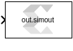

# Variable Size Signal to Workspace

This block is used to save variable size signal data to the MATLAB® workspace.

  
  

## Library

AI Engine/Tools

## Description

AI Engine blocks produce variable signal outputs. The Variable Size
Signal to Workspace block allows you to write data into the MATLAB
workspace in a structured format.

This block behaves similarly to the Simulink To Workspace block but
will make it easier to analyze the output data by discarding empty
sample in the input variable size signal and concatenating valid samples
into a MATALB vector. This block can only be connected to a variable
size signal. The settings of the block can be accessed from Simulink
Model settings (Ctrl+E) under the Data Import/Export tab. In particular,
here you can set all simulation outputs as a single Simulink Simulation
Output object or as individual variables.

## Parameters

#### Variable Name  
Using this parameter, you can specify the name for workspace variable.

--------------
Copyright (C) 2024 Advanced Micro Devices, Inc.
All rights reserved.
