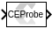
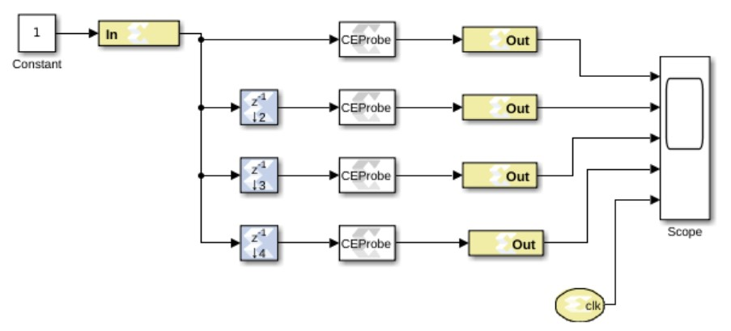
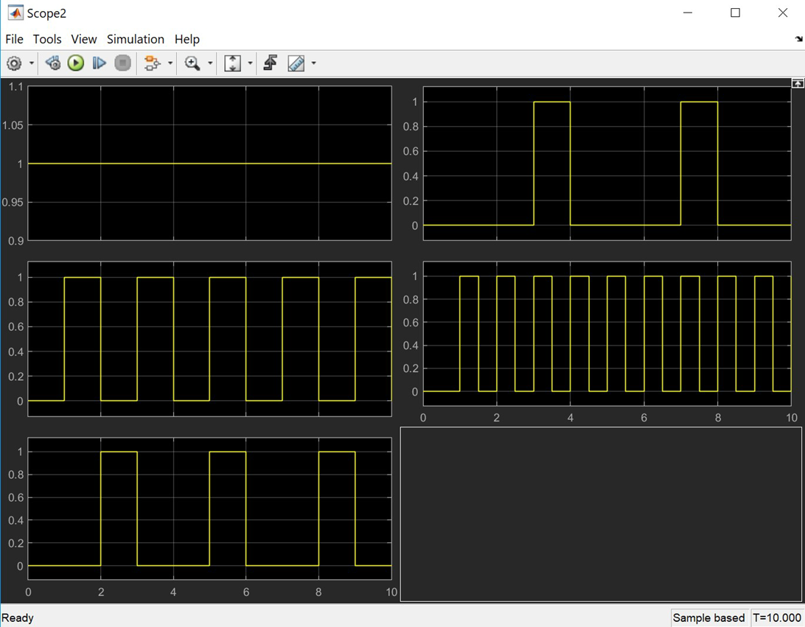

# Clock Enable Probe

The Clock Enable (CE) Probe provides a mechanism for extracting
derived clock enable signals from Xilinx signals in Model Composer
models.

  
  

## Description
The probe accepts any Xilinx signal type as input, and produces a Bool
output signal. The Bool output can be used at any point in the design
where Bools are acceptable. The probe output is a cyclical pulse that
mimics the behavior of an ideal clock enable signal used in the hardware
implementation of a multirate circuit. The frequency of the pulse is
derived from the input signal's sample period. The enable pulse is
asserted at the end of the input signal's sample period for the duration
of one Simulink® system period. For signals with a sample period equal
to the Simulink system period, the block's output is always one.

Shown below is an example model with an attached analysis scope that
demonstrates the usage and behavior of the Clock Enable Probe. The
Simulink system sample period for the model is specified in the System
Generator token as 1.0 seconds. In addition to the Simulink system
period, the model has three other sample periods defined by the Down
Sample blocks. Clock Enable Probes are placed after each Down Sample
block and extract the derived clock enable signal. The probe outputs are
run to output gateways and then to the scope for analysis. Also included
in the model is CLK probe that produces a Double representation of the
hardware system clock. The scope output shows the output from the four
Clock Enable probes in addition to the CLK probe output.

  
  

## Options

Use clock enable signal without Multi-Cycle path constraints  
Used to disable multi-cycle path constraints on the generated signal
from the Clock Enable Probe block. This is typically applied when the
signal generated is used as separate timing signal that is not
clock-enable related.

--------------
Copyright (C) 2024 Advanced Micro Devices, Inc.
All rights reserved.
