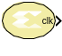

# Clock Probe

The Clock Probe generates a double-precision representation of a
clock signal with a period equal to the Simulink® system period.

## Description
The output clock signal has a 50/50 duty cycle with the clock asserted
at the start of the Simulink sample period. The Clock Probe's double
output is useful only for analysis, and cannot be translated into
hardware.

## Parameters
There are no parameters for this block.

--------------
Copyright (C) 2024 Advanced Micro Devices, Inc.
All rights reserved.

SPDX-License-Identifier: MIT
