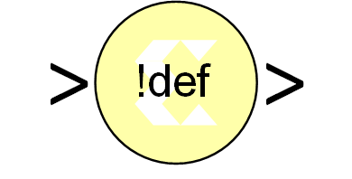

# Indeterminate Probe

The output of the Xilinx Indeterminate Probe indicates whether the input
data is indeterminate (MATLAB value NaN). An indeterminate data value
corresponds to a VHDL indeterminate logic data value of 'X'.

The probe accepts any Xilinx signal as input and produces a double
signal as output. Indeterminate data on the probe input will result in
an assertion of the output signal indicated by a value one. Otherwise,
the probe output is zero.
